# AkademiQ SaaS Business Processes (Improved v4 - Academic Year Aware)

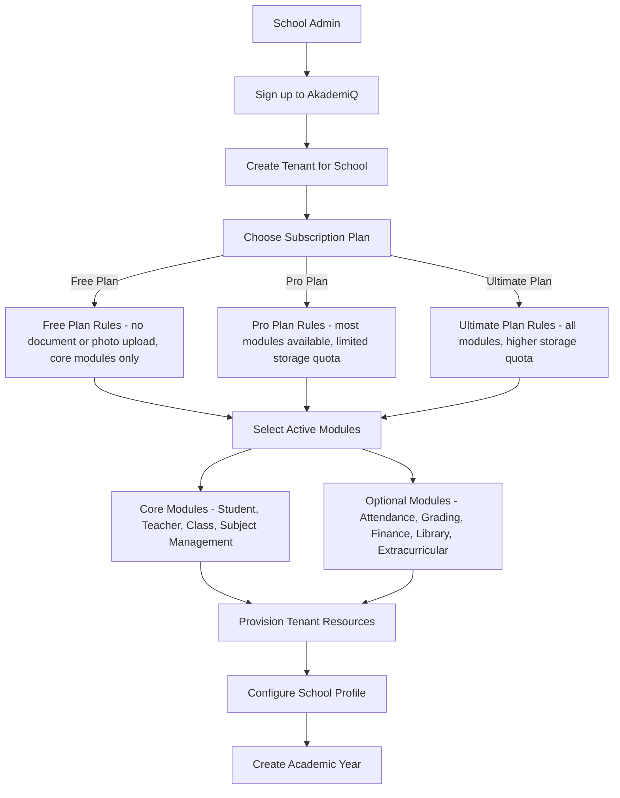
```mermaid
flowchart TD
    A[School Admin] --> B[Sign up to AkademiQ]
    B --> C[Create Tenant for School]

    C --> D[Choose Subscription Plan]
    D -->|Free Plan| D1[Free Plan Rules - no document or photo upload, core modules only]
    D -->|Pro Plan| D2[Pro Plan Rules - most modules available, limited storage quota]
    D -->|Ultimate Plan| D3[Ultimate Plan Rules - all modules, higher storage quota]

    D1 --> E[Select Active Modules]
    D2 --> E
    D3 --> E

    E --> E1[Core Modules - Student, Teacher, Class, Subject Management]
    E --> E2[Optional Modules - Attendance, Grading, Finance, Library, Extracurricular]

    E1 --> F[Provision Tenant Resources]
    E2 --> F
    F --> G[Configure School Profile]
    G --> G1[Create Academic Year]
```

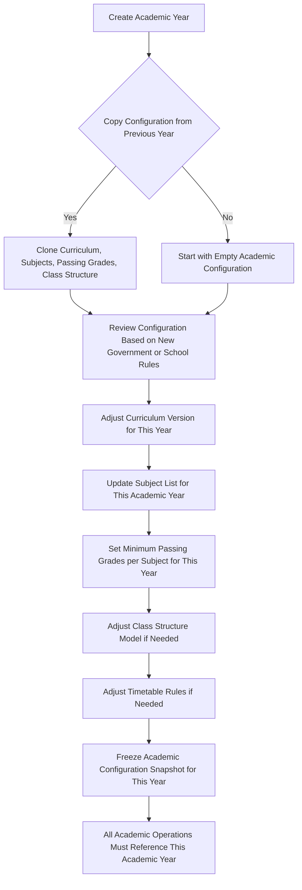
```mermaid
flowchart TD
    A[Create Academic Year] --> B{Copy Configuration from Previous Year}
    B -->|Yes| C[Clone Curriculum, Subjects, Passing Grades, Class Structure]
    B -->|No| D[Start with Empty Academic Configuration]

    C --> E[Review Configuration Based on New Government or School Rules]
    D --> E

    E --> F[Adjust Curriculum Version for This Year]
    F --> G[Update Subject List for This Academic Year]
    G --> H[Set Minimum Passing Grades per Subject for This Year]
    H --> I[Adjust Class Structure Model if Needed]
    I --> J[Adjust Timetable Rules if Needed]

    J --> K[Freeze Academic Configuration Snapshot for This Year]
    K --> L[All Academic Operations Must Reference This Academic Year]
```

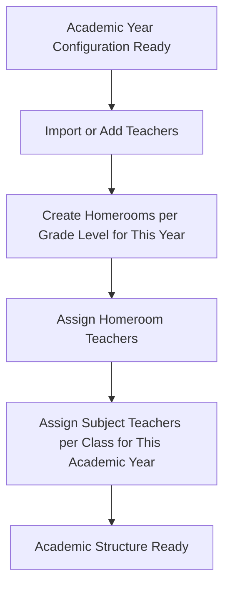
```mermaid
flowchart TD
    A[Academic Year Configuration Ready] --> B[Import or Add Teachers]
    B --> C[Create Homerooms per Grade Level for This Year]
    C --> D[Assign Homeroom Teachers]
    D --> E[Assign Subject Teachers per Class for This Academic Year]
    E --> F[Academic Structure Ready]
```

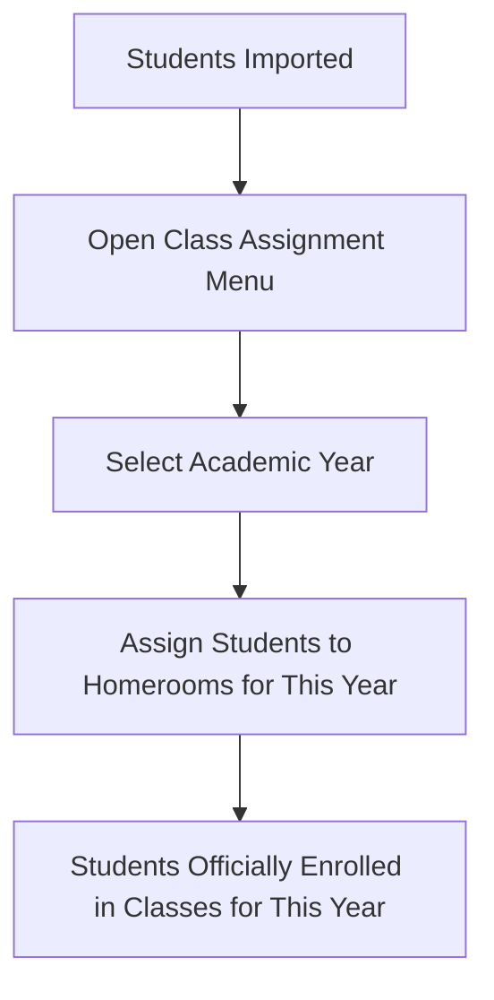
```mermaid
flowchart TD
    A[Students Imported] --> B[Open Class Assignment Menu]
    B --> C[Select Academic Year]
    C --> D[Assign Students to Homerooms for This Year]
    D --> E[Students Officially Enrolled in Classes for This Year]
```

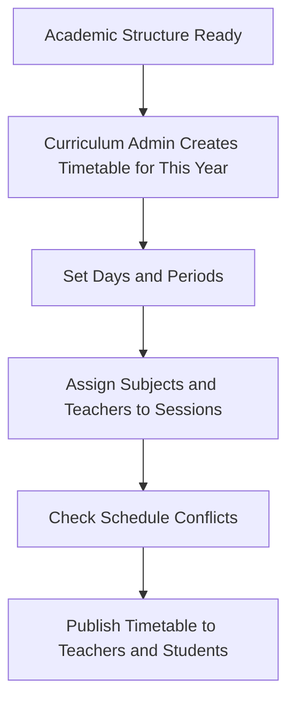
```mermaid
flowchart TD
    A[Academic Structure Ready] --> B[Curriculum Admin Creates Timetable for This Year]
    B --> C[Set Days and Periods]
    C --> D[Assign Subjects and Teachers to Sessions]
    D --> E[Check Schedule Conflicts]
    E --> F[Publish Timetable to Teachers and Students]
```

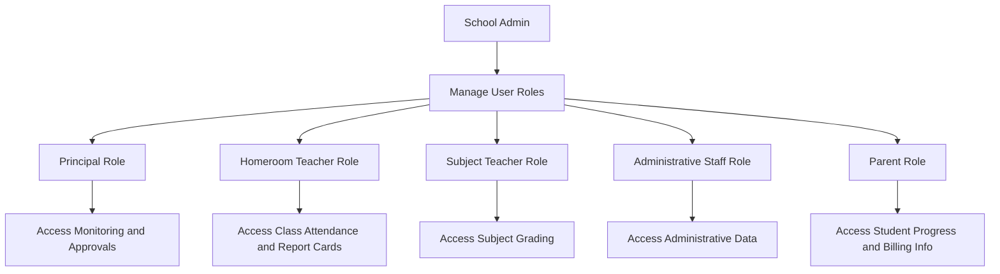
```mermaid
flowchart TD
    A[School Admin] --> B[Manage User Roles]
    B --> C[Principal Role]
    B --> D[Homeroom Teacher Role]
    B --> E[Subject Teacher Role]
    B --> F[Administrative Staff Role]
    B --> G[Parent Role]

    C --> H[Access Monitoring and Approvals]
    D --> I[Access Class Attendance and Report Cards]
    E --> J[Access Subject Grading]
    F --> K[Access Administrative Data]
    G --> L[Access Student Progress and Billing Info]
```

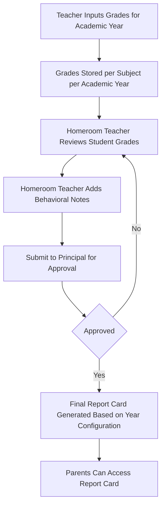
```mermaid
flowchart TD
    A[Teacher Inputs Grades for Academic Year] --> B[Grades Stored per Subject per Academic Year]
    B --> C[Homeroom Teacher Reviews Student Grades]
    C --> D[Homeroom Teacher Adds Behavioral Notes]
    D --> E[Submit to Principal for Approval]
    E --> F{Approved}
    F -->|No| C
    F -->|Yes| G[Final Report Card Generated Based on Year Configuration]
    G --> H[Parents Can Access Report Card]
```

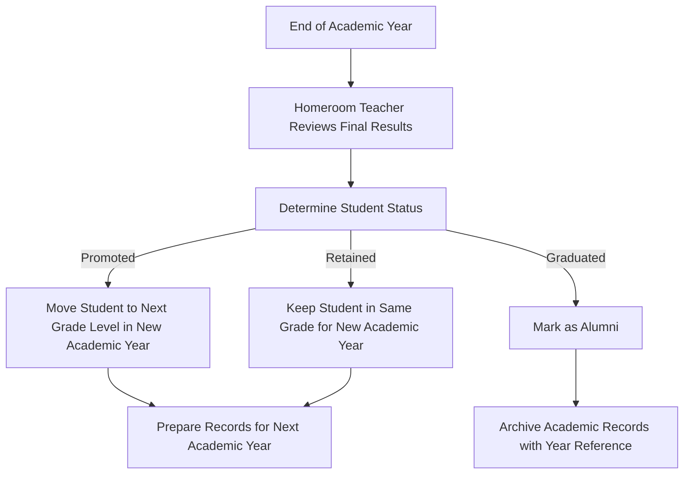
```mermaid
flowchart TD
    A[End of Academic Year] --> B[Homeroom Teacher Reviews Final Results]
    B --> C[Determine Student Status]
    C -->|Promoted| D[Move Student to Next Grade Level in New Academic Year]
    C -->|Retained| E[Keep Student in Same Grade for New Academic Year]
    C -->|Graduated| F[Mark as Alumni]

    D --> G[Prepare Records for Next Academic Year]
    E --> G
    F --> H[Archive Academic Records with Year Reference]
```

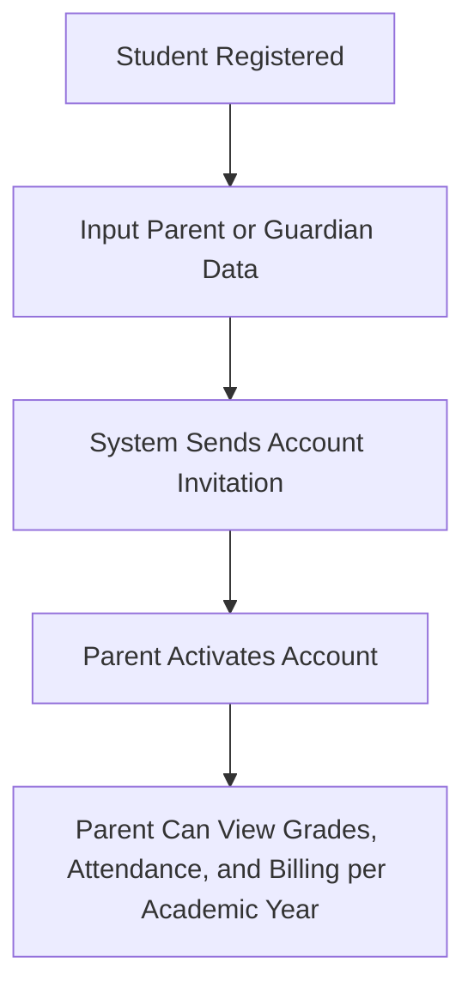
```mermaid
flowchart TD
    A[Student Registered] --> B[Input Parent or Guardian Data]
    B --> C[System Sends Account Invitation]
    C --> D[Parent Activates Account]
    D --> E[Parent Can View Grades, Attendance, and Billing per Academic Year]
```

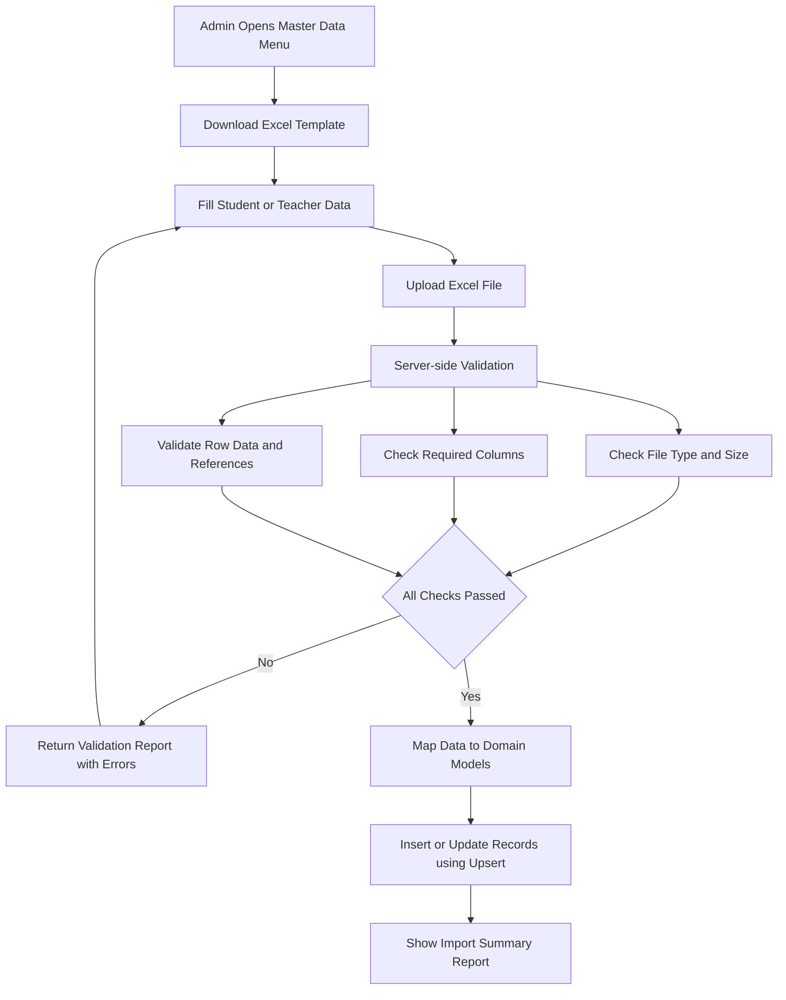
```mermaid
flowchart TD
    A[Admin Opens Master Data Menu] --> B[Download Excel Template]
    B --> C[Fill Student or Teacher Data]
    C --> D[Upload Excel File]
    D --> E[Server-side Validation]

    E --> F[Check File Type and Size]
    E --> G[Check Required Columns]
    E --> H[Validate Row Data and References]

    F --> I{All Checks Passed}
    G --> I
    H --> I

    I -->|No| J[Return Validation Report with Errors]
    J --> C

    I -->|Yes| K[Map Data to Domain Models]
    K --> L[Insert or Update Records using Upsert]
    L --> M[Show Import Summary Report]
```

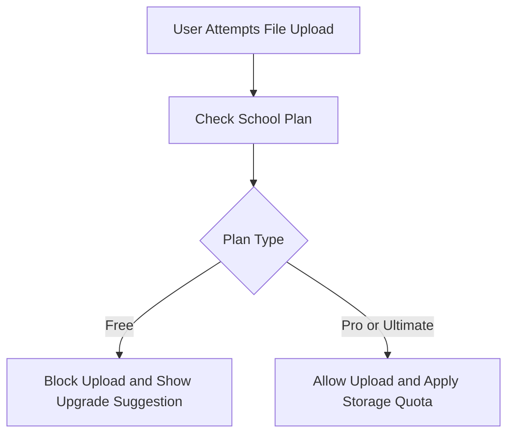
```mermaid
flowchart TD
    A[User Attempts File Upload] --> B[Check School Plan]
    B --> C{Plan Type}
    C -->|Free| D[Block Upload and Show Upgrade Suggestion]
    C -->|Pro or Ultimate| E[Allow Upload and Apply Storage Quota]
```

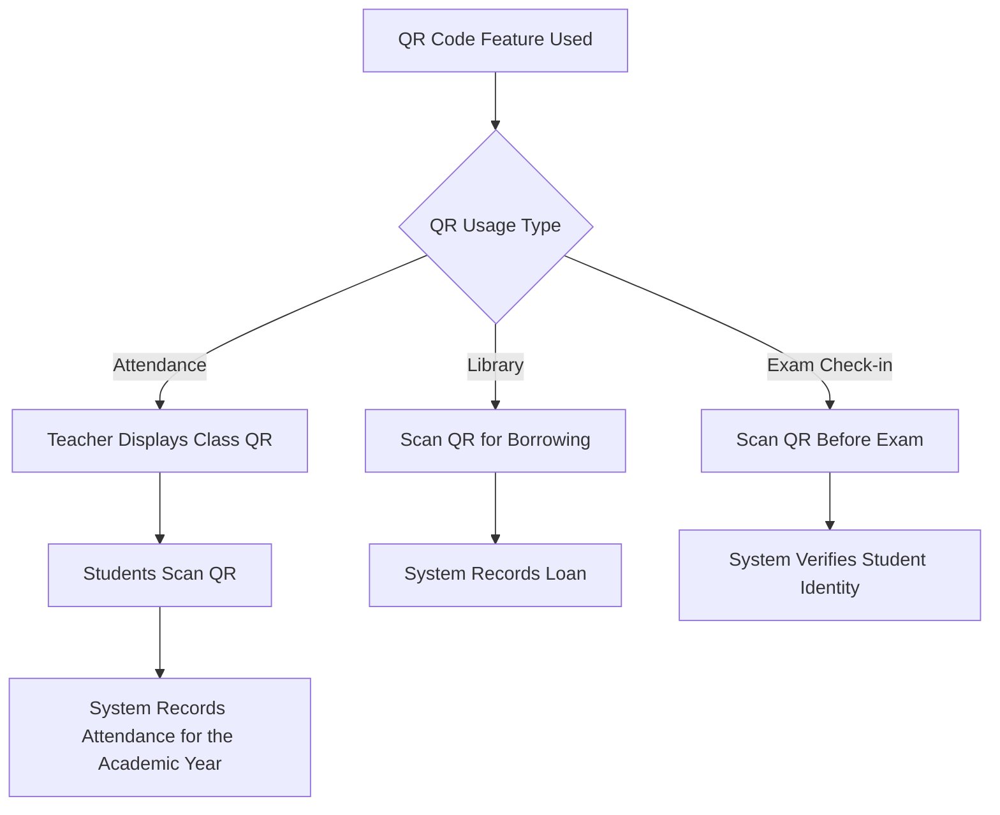
```mermaid
flowchart TD
    A[QR Code Feature Used] --> B{QR Usage Type}

    B -->|Attendance| C[Teacher Displays Class QR]
    C --> D[Students Scan QR]
    D --> E[System Records Attendance for the Academic Year]

    B -->|Library| F[Scan QR for Borrowing]
    F --> G[System Records Loan]

    B -->|Exam Check-in| H[Scan QR Before Exam]
    H --> I[System Verifies Student Identity]
```
