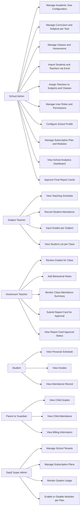

# AcademiQ Use Case Diagram

```mermaid
flowchart LR

Admin[School Admin]
Teacher[Subject Teacher]
Homeroom[Homeroom Teacher]
Student[Student]
Parent[Parent or Guardian]
SuperAdmin[SaaS Super Admin]

Admin --> UC1[Manage Academic Year Configuration]
Admin --> UC2[Manage Curriculum and Subjects per Year]
Admin --> UC3[Manage Classes and Homerooms]
Admin --> UC4[Import Students and Teachers via Excel]
Admin --> UC5[Assign Teachers to Subjects and Classes]
Admin --> UC6[Manage User Roles and Permissions]
Admin --> UC7[Configure School Profile]
Admin --> UC8[Manage Subscription Plan and Modules]
Admin --> UC9[View School Analytics Dashboard]

Teacher --> UC10[View Teaching Schedule]
Teacher --> UC11[Record Student Attendance]
Teacher --> UC12[Input Grades per Subject]
Teacher --> UC13[View Student List per Class]

Homeroom --> UC14[Review Grades for Class]
Homeroom --> UC15[Add Behavioral Notes]
Homeroom --> UC16[Monitor Class Attendance Summary]
Homeroom --> UC17[Submit Report Card for Approval]
Homeroom --> UC18[View Report Card Approval Status]

Admin --> UC19[Approve Final Report Cards]

Student --> UC20[View Personal Schedule]
Student --> UC21[View Grades]
Student --> UC22[View Attendance Record]

Parent --> UC23[View Child Grades]
Parent --> UC24[View Child Attendance]
Parent --> UC25[View Billing Information]

SuperAdmin --> UC26[Manage School Tenants]
SuperAdmin --> UC27[Manage Subscription Plans]
SuperAdmin --> UC28[Monitor System Usage]
SuperAdmin --> UC29[Enable or Disable Modules per Plan]
```
