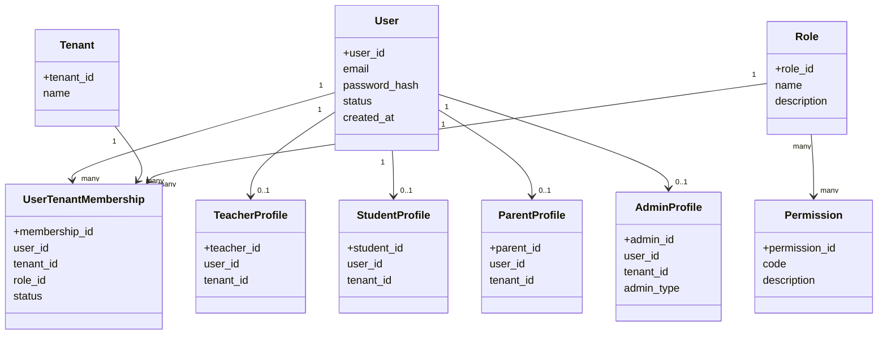

# AcademiQ Identity & Access Domain Model

## IAM = Identity and Access Management

```mermaid
classDiagram

class User {
  +user_id
  email
  password_hash
  status
  created_at
}

class Role {
  +role_id
  name
  description
}

class Permission {
  +permission_id
  code
  description
}

class UserTenantMembership {
  +membership_id
  user_id
  tenant_id
  role_id
  status
}

class Tenant {
  +tenant_id
  name
}

class TeacherProfile {
  +teacher_id
  user_id
  tenant_id
}

class StudentProfile {
  +student_id
  user_id
  tenant_id
}

class ParentProfile {
  +parent_id
  user_id
  tenant_id
}

class AdminProfile {
  +admin_id
  user_id
  tenant_id
  admin_type
}

User "1" --> "many" UserTenantMembership
Tenant "1" --> "many" UserTenantMembership
Role "1" --> "many" UserTenantMembership

Role "many" --> "many" Permission

User "1" --> "0..1" TeacherProfile
User "1" --> "0..1" StudentProfile
User "1" --> "0..1" ParentProfile
User "1" --> "0..1" AdminProfile
```
