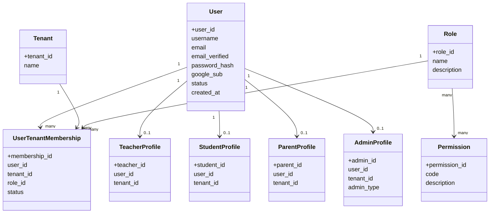

# AcademiQ Identity & Access Domain Model

## IAM = Identity and Access Management

## Identity model notes

- **`username`** is the universal identity: `NOT NULL`, globally unique
  (case-insensitive), auto-generated as a slug when not supplied, may not contain
  `@`. Every user has one.
- **`email`** is optional contact + login: nullable, unique when present
  (case-insensitive). Users without an email (e.g. older teachers/parents) log in
  by `username` + password. No synthetic placeholder emails are stored.
- **`password_hash`** is nullable: Google-only accounts have no password.
- **`google_sub`** is the linked Google subject id, unique when present, set when
  an account authenticates via "Login with Gmail". Returning Google users resolve
  by this value before email matching.
- **`email_verified`** flips true on email verification or a verified Google login.
  IAM only auto-links Google to an existing account when Google reports
  `email_verified=true`; unverified Google email collisions do not claim the
  existing account.
- **Identity ≠ membership**: a `User` can exist with **zero**
  `UserTenantMembership` rows (public signup / Google auto-provision) and may
  belong to **many** tenants. Login resolves a user independently of any tenant;
  tenant context is selected afterwards (see the login sequence diagram).
