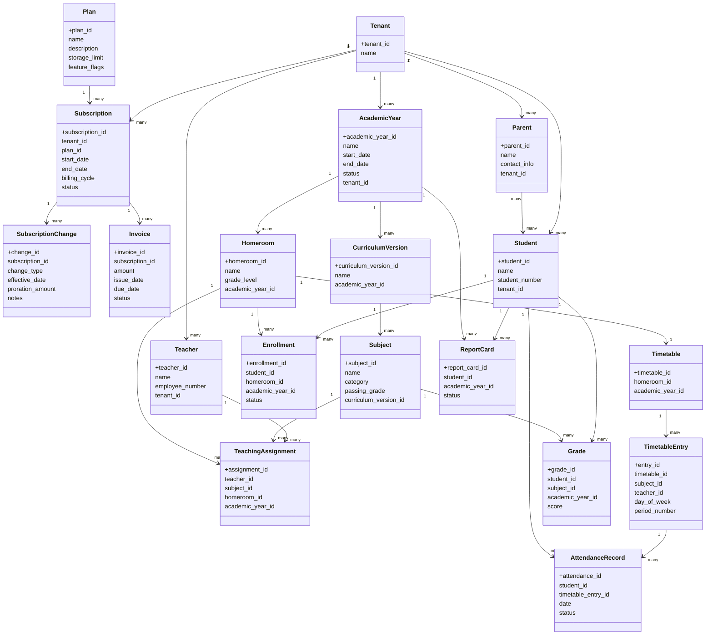

# AkademiQ Domain Model v2 (With Subscription Lifecycle)

```mermaid
classDiagram

class Tenant {
  +tenant_id
  name
}

class Plan {
  +plan_id
  name
  description
  storage_limit
  feature_flags
}

class Subscription {
  +subscription_id
  tenant_id
  plan_id
  start_date
  end_date
  billing_cycle
  status
}

class SubscriptionChange {
  +change_id
  subscription_id
  change_type
  effective_date
  proration_amount
  notes
}

class Invoice {
  +invoice_id
  subscription_id
  amount
  issue_date
  due_date
  status
}

class AcademicYear {
  +academic_year_id
  name
  start_date
  end_date
  status
  tenant_id
}

class CurriculumVersion {
  +curriculum_version_id
  name
  academic_year_id
}

class Subject {
  +subject_id
  name
  category
  passing_grade
  curriculum_version_id
}

class Teacher {
  +teacher_id
  name
  employee_number
  tenant_id
}

class Student {
  +student_id
  name
  student_number
  tenant_id
}

class Parent {
  +parent_id
  name
  contact_info
  tenant_id
}

class Homeroom {
  +homeroom_id
  name
  grade_level
  academic_year_id
}

class Enrollment {
  +enrollment_id
  student_id
  homeroom_id
  academic_year_id
  status
}

class TeachingAssignment {
  +assignment_id
  teacher_id
  subject_id
  homeroom_id
  academic_year_id
}

class Timetable {
  +timetable_id
  homeroom_id
  academic_year_id
}

class TimetableEntry {
  +entry_id
  timetable_id
  subject_id
  teacher_id
  day_of_week
  period_number
}

class AttendanceRecord {
  +attendance_id
  student_id
  timetable_entry_id
  date
  status
}

class Grade {
  +grade_id
  student_id
  subject_id
  academic_year_id
  score
}

class ReportCard {
  +report_card_id
  student_id
  academic_year_id
  status
}

Tenant "1" --> "many" Subscription
Plan "1" --> "many" Subscription
Subscription "1" --> "many" SubscriptionChange
Subscription "1" --> "many" Invoice

Tenant "1" --> "many" AcademicYear
AcademicYear "1" --> "many" CurriculumVersion
CurriculumVersion "1" --> "many" Subject
Tenant "1" --> "many" Teacher
Tenant "1" --> "many" Student
Tenant "1" --> "many" Parent
AcademicYear "1" --> "many" Homeroom
Student "1" --> "many" Enrollment
Homeroom "1" --> "many" Enrollment
Teacher "1" --> "many" TeachingAssignment
Subject "1" --> "many" TeachingAssignment
Homeroom "1" --> "many" TeachingAssignment
Homeroom "1" --> "1" Timetable
Timetable "1" --> "many" TimetableEntry
TimetableEntry "1" --> "many" AttendanceRecord
Student "1" --> "many" AttendanceRecord
Student "1" --> "many" Grade
Subject "1" --> "many" Grade
Student "1" --> "many" ReportCard
AcademicYear "1" --> "many" ReportCard
Parent "many" --> "many" Student
```
