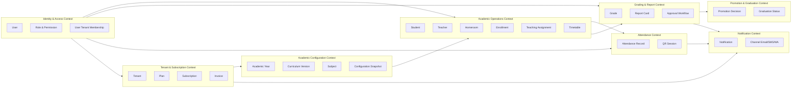

# AkademiQ Bounded Context Diagram

```mermaid
flowchart LR

subgraph IAM [Identity & Access Context]
    U[User]
    R[Role & Permission]
    M[User Tenant Membership]
end

subgraph TenantMgmt [Tenant & Subscription Context]
    T[Tenant]
    P[Plan]
    S[Subscription]
    I[Invoice]
end

subgraph AcademicConfig [Academic Configuration Context]
    AY[Academic Year]
    CV[Curriculum Version]
    SJ[Subject]
    CR[Configuration Snapshot]
end

subgraph AcademicOps [Academic Operations Context]
    ST[Student]
    TC[Teacher]
    HR[Homeroom]
    EN[Enrollment]
    TA[Teaching Assignment]
    TT[Timetable]
end

subgraph Attendance [Attendance Context]
    AR[Attendance Record]
    QR[QR Session]
end

subgraph Grading [Grading & Report Context]
    GD[Grade]
    RC[Report Card]
    AP[Approval Workflow]
end

subgraph Promotion [Promotion & Graduation Context]
    PR[Promotion Decision]
    GR[Graduation Status]
end

subgraph Notification [Notification Context]
    NT[Notification]
    CH[Channel Email/SMS/WA]
end

IAM --> AcademicOps
IAM --> Grading
IAM --> Attendance
IAM --> TenantMgmt

TenantMgmt --> AcademicConfig
AcademicConfig --> AcademicOps
AcademicOps --> Attendance
AcademicOps --> Grading
Grading --> Promotion

TenantMgmt --> Notification
Grading --> Notification
Attendance --> Notification
```
