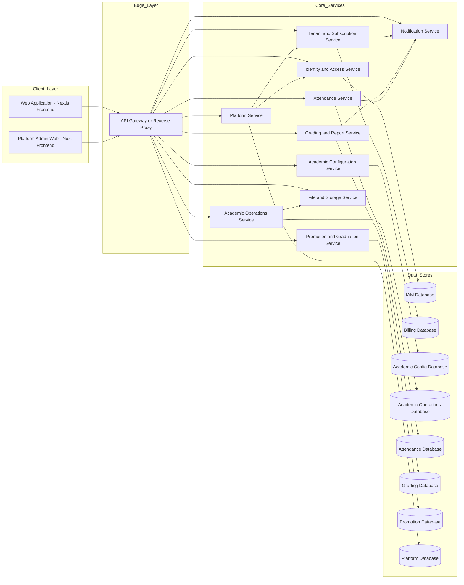

# AkademiQ Container Diagram (C4 Level 2)

```mermaid
flowchart LR

subgraph Client_Layer
    WEB[Web Application - Nextjs Frontend]
    ADMIN[Platform Admin Web - Nuxt Frontend]
end

subgraph Edge_Layer
    API[API Gateway or Reverse Proxy]
end

subgraph Core_Services
    IAM[Identity and Access Service]
    TENANT[Tenant and Subscription Service]
    ACFG[Academic Configuration Service]
    AOPS[Academic Operations Service]
    ATT[Attendance Service]
    GRD[Grading and Report Service]
    PROMO[Promotion and Graduation Service]
    NOTIF[Notification Service]
    FILE[File and Storage Service]
    PLATFORM[Platform Service]
end

subgraph Data_Stores
    IAMDB[(IAM Database)]
    TENANTDB[(Billing Database)]
    ACFGDB[(Academic Config Database)]
    AOPSDB[(Academic Operations Database)]
    ATTDB[(Attendance Database)]
    GRDDB[(Grading Database)]
    PROMODB[(Promotion Database)]
    PLATFORMDB[(Platform Database)]
end

WEB --> API
ADMIN --> API

API --> IAM
API --> TENANT
API --> ACFG
API --> AOPS
API --> ATT
API --> GRD
API --> PROMO
API --> NOTIF
API --> FILE
API --> PLATFORM

IAM --> IAMDB
TENANT --> TENANTDB
ACFG --> ACFGDB
AOPS --> AOPSDB
ATT --> ATTDB
GRD --> GRDDB
PROMO --> PROMODB
PLATFORM --> PLATFORMDB

PLATFORM --> TENANT
PLATFORM --> IAM
TENANT --> NOTIF
GRD --> NOTIF
ATT --> NOTIF
AOPS --> FILE
```
