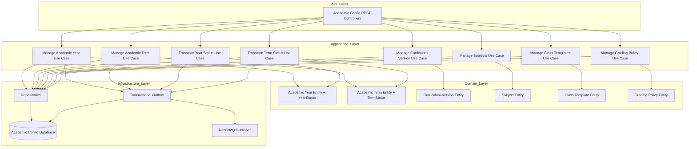

# AcademiQ Component Diagram — Academic Config Service

## Published Events

| Event | Trigger |
|-------|---------|
| `academic_year.created` | Year created |
| `academic_year.status_changed` | Year status transitioned |
| `academic_term.created` | Term created (including auto-seed on year creation) |
| `academic_term.status_changed` | Term status transitioned |
