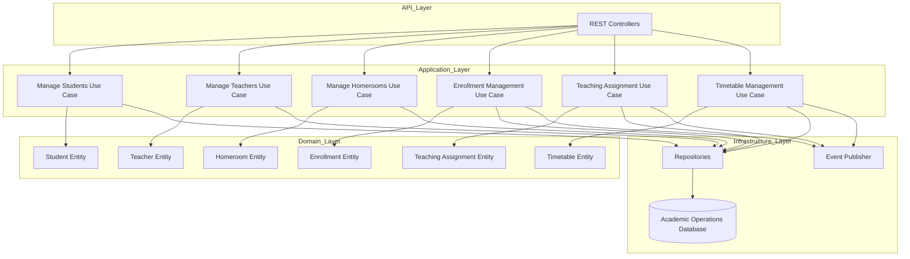

# AcademiQ Component Diagram - Academic Operations Service

```mermaid
flowchart TB

subgraph API_Layer
    CTRL[REST Controllers]
end

subgraph Application_Layer
    UC1[Manage Students Use Case]
    UC2[Manage Teachers Use Case]
    UC3[Manage Homerooms Use Case]
    UC4[Enrollment Management Use Case]
    UC5[Teaching Assignment Use Case]
    UC6[Timetable Management Use Case]
end

subgraph Domain_Layer
    ST[Student Entity]
    TC[Teacher Entity]
    HR[Homeroom Entity]
    EN[Enrollment Entity]
    TA[Teaching Assignment Entity]
    TT[Timetable Entity]
end

subgraph Infrastructure_Layer
    REPO[Repositories]
    DB[(Academic Operations Database)]
    EVENT[Event Publisher]
end

CTRL --> UC1
CTRL --> UC2
CTRL --> UC3
CTRL --> UC4
CTRL --> UC5
CTRL --> UC6

UC1 --> ST
UC2 --> TC
UC3 --> HR
UC4 --> EN
UC5 --> TA
UC6 --> TT

UC1 --> REPO
UC2 --> REPO
UC3 --> REPO
UC4 --> REPO
UC5 --> REPO
UC6 --> REPO

REPO --> DB
UC4 --> EVENT
UC5 --> EVENT
UC6 --> EVENT
```
