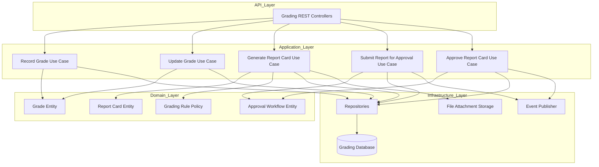

# AcademiQ Component Diagram - Grading and Report Service

```mermaid
flowchart TB

subgraph API_Layer
    CTRL[Grading REST Controllers]
end

subgraph Application_Layer
    UC1[Record Grade Use Case]
    UC2[Update Grade Use Case]
    UC3[Generate Report Card Use Case]
    UC4[Submit Report for Approval Use Case]
    UC5[Approve Report Card Use Case]
end

subgraph Domain_Layer
    GD[Grade Entity]
    RC[Report Card Entity]
    AP[Approval Workflow Entity]
    RULE[Grading Rule Policy]
end

subgraph Infrastructure_Layer
    REPO[Repositories]
    DB[(Grading Database)]
    EVENT[Event Publisher]
    FILE[File Attachment Storage]
end

CTRL --> UC1
CTRL --> UC2
CTRL --> UC3
CTRL --> UC4
CTRL --> UC5

UC1 --> GD
UC2 --> GD
UC3 --> RC
UC4 --> AP
UC5 --> AP
UC3 --> RULE

UC1 --> REPO
UC2 --> REPO
UC3 --> REPO
UC4 --> REPO
UC5 --> REPO

REPO --> DB
UC3 --> FILE
UC4 --> EVENT
UC5 --> EVENT
```
