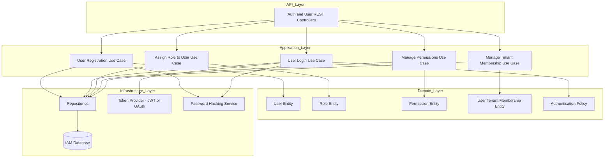

# AcademiQ Component Diagram - Identity and Access Service

```mermaid
flowchart TB

subgraph API_Layer
    CTRL[Auth and User REST Controllers]
end

subgraph Application_Layer
    UC1[User Registration Use Case]
    UC2[User Login Use Case]
    UC3[Assign Role to User Use Case]
    UC4[Manage Permissions Use Case]
    UC5[Manage Tenant Membership Use Case]
end

subgraph Domain_Layer
    USER[User Entity]
    ROLE[Role Entity]
    PERM[Permission Entity]
    MEMBER[User Tenant Membership Entity]
    AUTH[Authentication Policy]
end

subgraph Infrastructure_Layer
    REPO[Repositories]
    DB[(IAM Database)]
    TOKEN[Token Provider - JWT or OAuth]
    HASH[Password Hashing Service]
end

CTRL --> UC1
CTRL --> UC2
CTRL --> UC3
CTRL --> UC4
CTRL --> UC5

UC1 --> USER
UC2 --> AUTH
UC3 --> ROLE
UC4 --> PERM
UC5 --> MEMBER

UC1 --> REPO
UC2 --> REPO
UC3 --> REPO
UC4 --> REPO
UC5 --> REPO

REPO --> DB
UC2 --> TOKEN
UC1 --> HASH
UC2 --> HASH
```
