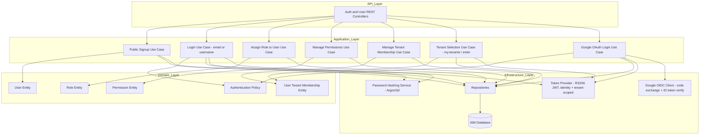

# AcademiQ Component Diagram - Identity and Access Service

## Identity & token notes

- **Login** (`UC2`) accepts an email **or** username identifier and issues a
  tenant-less **identity token**.
- **Tenant selection** (`UC6`) exchanges an identity token for a **tenant-scoped**
  token via `GET /my-tenants` + `POST /tenants/{id}/enter`, checking membership.
- **Google OAuth** (`UC7`) verifies a Google ID token and match-or-creates an
  account, then issues an identity token — IAM remains the sole token issuer (no
  external IdP).
- **Public signup** (`UC1`) creates accounts independent of any tenant; passwords
  are optional (Google-only accounts have none).
