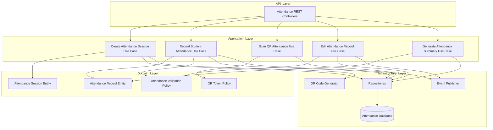

# AkademiQ Component Diagram - Attendance Service

```mermaid
flowchart TB

subgraph API_Layer
    CTRL[Attendance REST Controllers]
end

subgraph Application_Layer
    UC1[Create Attendance Session Use Case]
    UC2[Record Student Attendance Use Case]
    UC3[Scan QR Attendance Use Case]
    UC4[Edit Attendance Record Use Case]
    UC5[Generate Attendance Summary Use Case]
end

subgraph Domain_Layer
    SESSION[Attendance Session Entity]
    RECORD[Attendance Record Entity]
    POLICY[Attendance Validation Policy]
    QR[QR Token Policy]
end

subgraph Infrastructure_Layer
    REPO[Repositories]
    DB[(Attendance Database)]
    QRGEN[QR Code Generator]
    EVENT[Event Publisher]
end

CTRL --> UC1
CTRL --> UC2
CTRL --> UC3
CTRL --> UC4
CTRL --> UC5

UC1 --> SESSION
UC2 --> RECORD
UC3 --> QR
UC2 --> POLICY
UC4 --> POLICY
UC5 --> RECORD

UC1 --> REPO
UC2 --> REPO
UC3 --> REPO
UC4 --> REPO
UC5 --> REPO

REPO --> DB
UC1 --> QRGEN
UC2 --> EVENT
UC4 --> EVENT
```
