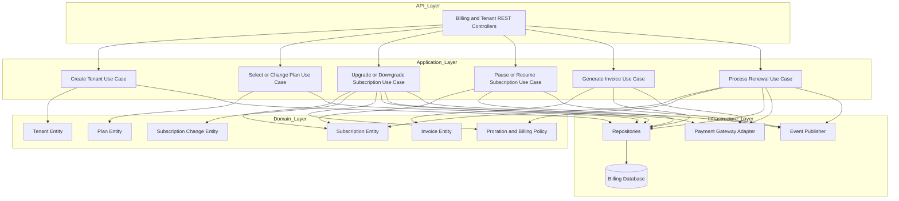

# AkademiQ Component Diagram - Tenant and Subscription Service

```mermaid
flowchart TB

subgraph API_Layer
    CTRL[Billing and Tenant REST Controllers]
end

subgraph Application_Layer
    UC1[Create Tenant Use Case]
    UC2[Select or Change Plan Use Case]
    UC3[Upgrade or Downgrade Subscription Use Case]
    UC4[Pause or Resume Subscription Use Case]
    UC5[Generate Invoice Use Case]
    UC6[Process Renewal Use Case]
end

subgraph Domain_Layer
    TEN[Tenant Entity]
    PLAN[Plan Entity]
    SUB[Subscription Entity]
    CHANGE[Subscription Change Entity]
    INV[Invoice Entity]
    POLICY[Proration and Billing Policy]
end

subgraph Infrastructure_Layer
    REPO[Repositories]
    DB[(Billing Database)]
    PAY[Payment Gateway Adapter]
    EVENT[Event Publisher]
end

CTRL --> UC1
CTRL --> UC2
CTRL --> UC3
CTRL --> UC4
CTRL --> UC5
CTRL --> UC6

UC1 --> TEN
UC2 --> PLAN
UC3 --> SUB
UC3 --> CHANGE
UC4 --> SUB
UC5 --> INV
UC6 --> SUB
UC3 --> POLICY
UC6 --> POLICY

UC1 --> REPO
UC2 --> REPO
UC3 --> REPO
UC4 --> REPO
UC5 --> REPO
UC6 --> REPO

REPO --> DB
UC3 --> PAY
UC5 --> PAY
UC6 --> PAY

UC3 --> EVENT
UC4 --> EVENT
UC6 --> EVENT
```
