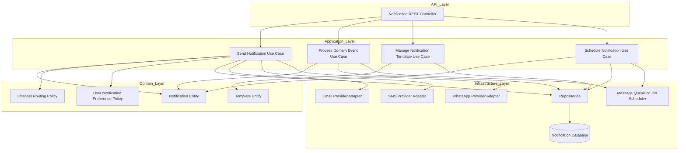

# AkademiQ Component Diagram - Notification Service

```mermaid
flowchart TB

subgraph API_Layer
    CTRL[Notification REST Controller]
end

subgraph Application_Layer
    UC1[Send Notification Use Case]
    UC2[Process Domain Event Use Case]
    UC3[Manage Notification Template Use Case]
    UC4[Schedule Notification Use Case]
end

subgraph Domain_Layer
    NOTIF[Notification Entity]
    TEMPLATE[Template Entity]
    PREF[User Notification Preference Policy]
    ROUTE[Channel Routing Policy]
end

subgraph Infrastructure_Layer
    REPO[Repositories]
    DB[(Notification Database)]
    EMAIL[Email Provider Adapter]
    SMS[SMS Provider Adapter]
    WA[WhatsApp Provider Adapter]
    QUEUE[Message Queue or Job Scheduler]
end

CTRL --> UC1
CTRL --> UC2
CTRL --> UC3
CTRL --> UC4

UC1 --> NOTIF
UC1 --> ROUTE
UC2 --> NOTIF
UC3 --> TEMPLATE
UC4 --> NOTIF
UC1 --> PREF

UC1 --> REPO
UC2 --> REPO
UC3 --> REPO
UC4 --> REPO

REPO --> DB

UC1 --> EMAIL
UC1 --> SMS
UC1 --> WA

UC2 --> QUEUE
UC4 --> QUEUE
```
