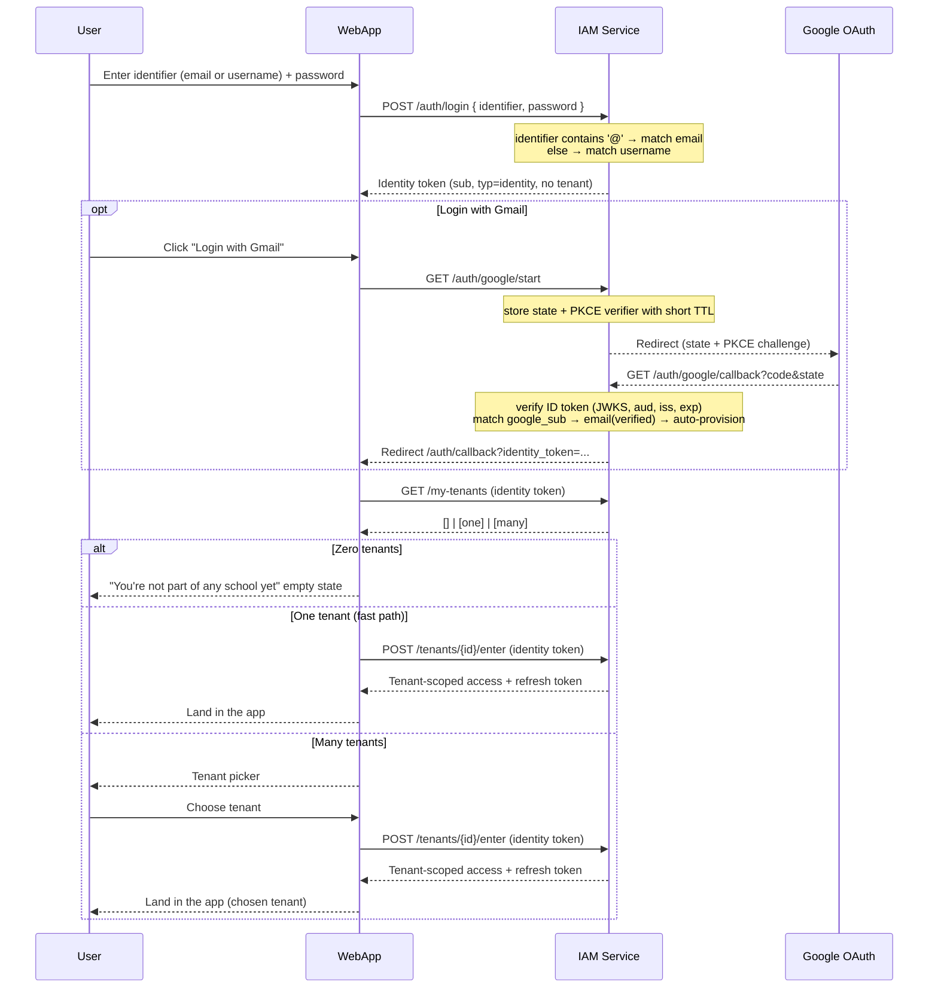

# Sequence Diagram — User Login with Tenant Resolution

Login is a **two-step exchange** (identity token → tenant-scoped token). A user
authenticates with an email **or** username (or "Login with Gmail"), receives a
tenant-less **identity token**, then *enters* a tenant to obtain the
tenant-scoped token that the rest of the system already verifies. A user may
belong to zero, one, or many tenants.

## Notes

- **Identity token**: `{ sub, typ:"identity" }`, short-lived, non-refreshable. It
  authorizes tenant-less routes. `/me` and `/my-tenants` also accept a
  tenant-scoped access token, so a user who has entered a tenant need not retain
  the identity token.
- **Tenant-scoped token**: `{ sub, tenant_id, roles, perms, typ:"access" }` — the
  token every other service verifies. Only `POST /tenants/{id}/enter` mints it,
  and only after checking `user_tenant_role` membership. Carries `roles[]` (role
  identity) and the deduplicated `perms[]` union (authorization).
- **Refresh tokens are tenant-scoped**: refreshing renews the same tenant's token
  using the refresh token alone (no live access token needed); switching tenants
  is a fresh `/enter`, not a refresh.
- **Identity ≠ membership**: accounts are created by public signup, by Google
  auto-provisioning, or by invitation; tenant membership is granted separately by
  accepting an invitation. An account can exist with no tenants.
- **Google callback errors** redirect to `/auth/callback?oauth_error=...`; the
  web app surfaces the error and returns the user to login.
