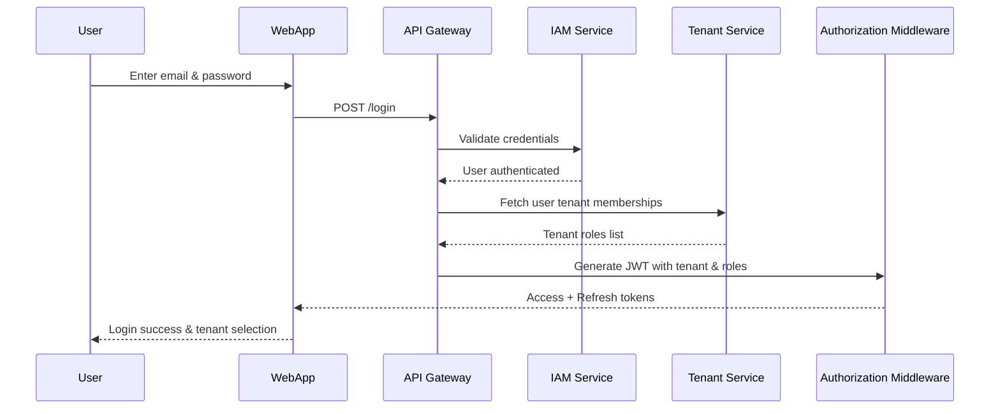

# Sequence Diagram — User Login with Tenant Resolution

```mermaid
sequenceDiagram
participant User
participant WebApp
participant APIGW as API Gateway
participant IAM as IAM Service
participant Tenant as Tenant Service
participant AuthZ as Authorization Middleware

User->>WebApp: Enter email & password
WebApp->>APIGW: POST /login
APIGW->>IAM: Validate credentials
IAM-->>APIGW: User authenticated
APIGW->>Tenant: Fetch user tenant memberships
Tenant-->>APIGW: Tenant roles list
APIGW->>AuthZ: Generate JWT with tenant & roles
AuthZ-->>WebApp: Access + Refresh tokens
WebApp-->>User: Login success & tenant selection
```