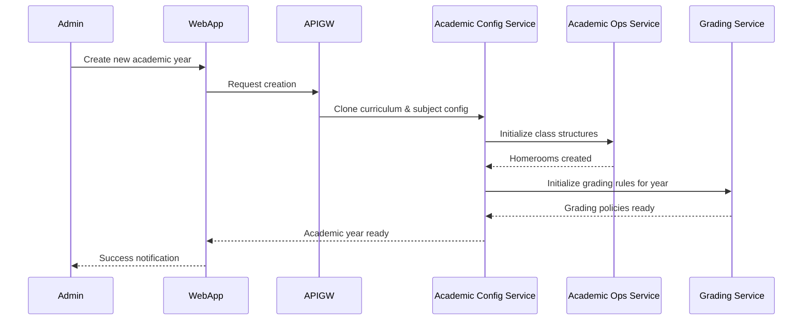

# Sequence Diagram — Academic Year Initialization

```mermaid
sequenceDiagram
participant Admin
participant WebApp
participant APIGW
participant ACFG as Academic Config Service
participant AOPS as Academic Ops Service
participant GRD as Grading Service

Admin->>WebApp: Create new academic year
WebApp->>APIGW: Request creation
APIGW->>ACFG: Clone curriculum & subject config
ACFG->>AOPS: Initialize class structures
AOPS-->>ACFG: Homerooms created
ACFG->>GRD: Initialize grading rules for year
GRD-->>ACFG: Grading policies ready
ACFG-->>WebApp: Academic year ready
WebApp-->>Admin: Success notification
```