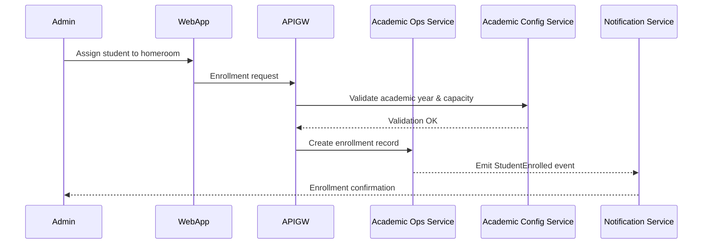

# Sequence Diagram — Student Enrollment Flow

```mermaid
sequenceDiagram
participant Admin
participant WebApp
participant APIGW
participant AOPS as Academic Ops Service
participant ACFG as Academic Config Service
participant NOTIF as Notification Service

Admin->>WebApp: Assign student to homeroom
WebApp->>APIGW: Enrollment request
APIGW->>ACFG: Validate academic year & capacity
ACFG-->>APIGW: Validation OK
APIGW->>AOPS: Create enrollment record
AOPS-->>NOTIF: Emit StudentEnrolled event
NOTIF-->>Admin: Enrollment confirmation
```