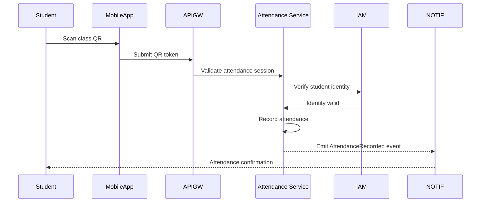

# Sequence Diagram — QR Attendance Scan Flow

```mermaid
sequenceDiagram
participant Student
participant MobileApp
participant APIGW
participant ATT as Attendance Service
participant IAM
participant NOTIF

Student->>MobileApp: Scan class QR
MobileApp->>APIGW: Submit QR token
APIGW->>ATT: Validate attendance session
ATT->>IAM: Verify student identity
IAM-->>ATT: Identity valid
ATT->>ATT: Record attendance
ATT-->>NOTIF: Emit AttendanceRecorded event
NOTIF-->>Student: Attendance confirmation
```