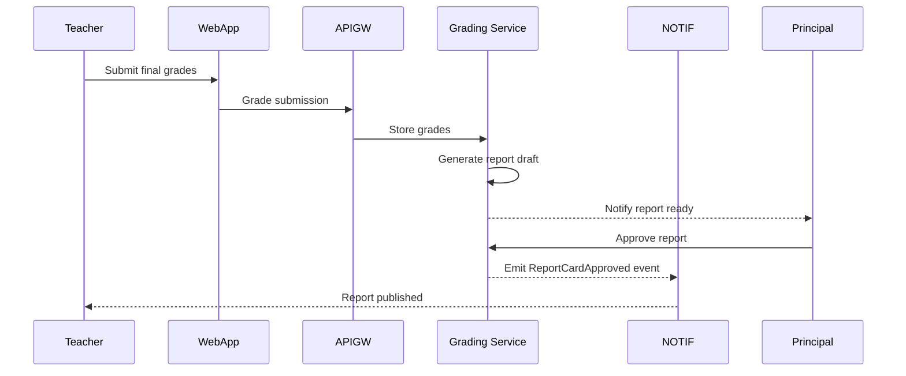

# Sequence Diagram — Grade Submission to Report Approval

```mermaid
sequenceDiagram
participant Teacher
participant WebApp
participant APIGW
participant GRD as Grading Service
participant NOTIF
participant Principal

Teacher->>WebApp: Submit final grades
WebApp->>APIGW: Grade submission
APIGW->>GRD: Store grades
GRD->>GRD: Generate report draft
GRD-->>Principal: Notify report ready
Principal->>GRD: Approve report
GRD-->>NOTIF: Emit ReportCardApproved event
NOTIF-->>Teacher: Report published
```