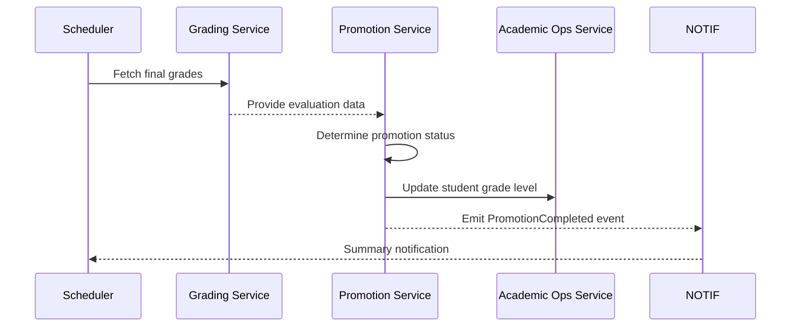

# Sequence Diagram — End of Year Promotion Process

```mermaid
sequenceDiagram
participant Scheduler
participant GRD as Grading Service
participant PROMO as Promotion Service
participant AOPS as Academic Ops Service
participant NOTIF

Scheduler->>GRD: Fetch final grades
GRD-->>PROMO: Provide evaluation data
PROMO->>PROMO: Determine promotion status
PROMO->>AOPS: Update student grade level
PROMO-->>NOTIF: Emit PromotionCompleted event
NOTIF-->>Scheduler: Summary notification
```