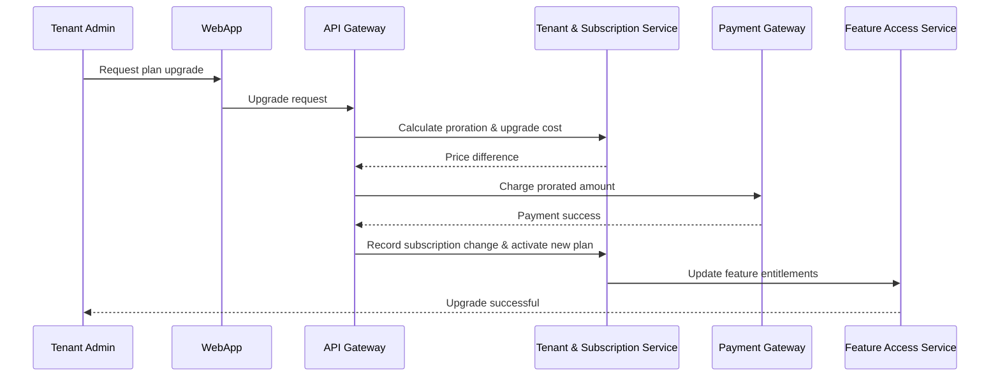

# Sequence Diagram — Plan Upgrade with Proration (Unified Billing Service)

```mermaid
sequenceDiagram
participant Admin as Tenant Admin
participant WebApp
participant APIGW as API Gateway
participant BILL as Tenant & Subscription Service
participant PAY as Payment Gateway
participant FEATURE as Feature Access Service

Admin->>WebApp: Request plan upgrade
WebApp->>APIGW: Upgrade request
APIGW->>BILL: Calculate proration & upgrade cost
BILL-->>APIGW: Price difference

APIGW->>PAY: Charge prorated amount
PAY-->>APIGW: Payment success

APIGW->>BILL: Record subscription change & activate new plan
BILL->>FEATURE: Update feature entitlements

FEATURE-->>Admin: Upgrade successful
```