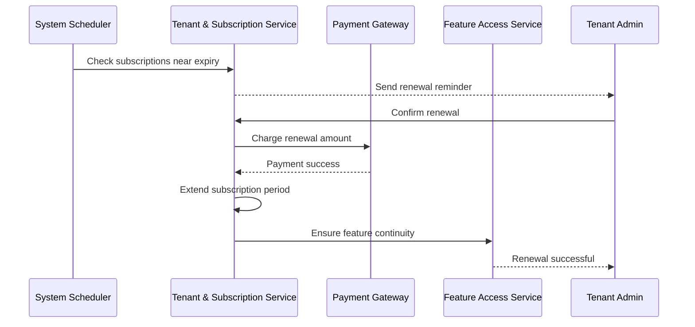

# Sequence Diagram — Subscription Renewal (Unified Billing Service)

```mermaid
sequenceDiagram
participant Scheduler as System Scheduler
participant BILL as Tenant & Subscription Service
participant PAY as Payment Gateway
participant FEATURE as Feature Access Service
participant Admin as Tenant Admin

Scheduler->>BILL: Check subscriptions near expiry
BILL-->>Admin: Send renewal reminder

Admin->>BILL: Confirm renewal
BILL->>PAY: Charge renewal amount
PAY-->>BILL: Payment success

BILL->>BILL: Extend subscription period
BILL->>FEATURE: Ensure feature continuity

FEATURE-->>Admin: Renewal successful
```