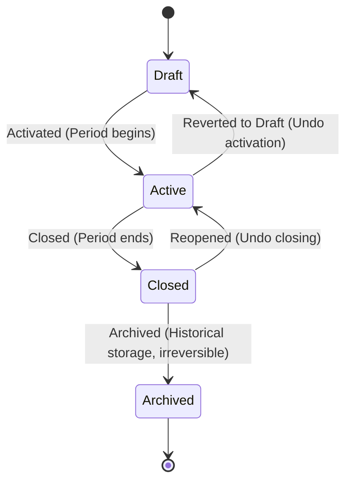

# AcademiQ State Diagram — Academic Term Lifecycle

## 🧠 What This State Diagram Defines

This models how an `academic_term` entity transitions from creation to archival. The state machine mirrors the academic year lifecycle exactly. Every status change requires a minimum 10-character `reason`, written to `academic_term_status_transition` as an interim audit log.

## States

🟡 **Draft**

- The term is created but not yet active.
- Evaluation setup is allowed (`TERM_NOT_EDITABLE` is not triggered).
- Grade entry is blocked (`TERM_NOT_ACTIVE`).

🟢 **Active**

- The teaching period is officially running.
- Evaluation setup and grade entry are both allowed.
- At most one term per academic year may be `Active` at any given time (enforced by partial unique index).

✅ **Closed**

- The period has ended.
- Evaluation creation and edits are blocked (`TERM_NOT_EDITABLE`).
- Grade entry is blocked (`TERM_NOT_ACTIVE`).
- The term can be reopened back to `Active` (checks for one-active-term conflict).

📦 **Archived**

- Long-term historical storage.
- **Irreversible**: cannot transition back to any other state.
- Evaluation edits and grade entry remain blocked.

## Parent-Child Coordination

| Year transition | Term requirement |
|---|---|
| `→ Active` | None — year may be Active with all terms in Draft |
| `→ Closed` | Rejected (`TERM_STILL_ACTIVE`, HTTP 409) if any term is `Active` |
| `→ Archived` | All terms must be `Archived` (implied by the closing sequence) |
| `→ Draft` (undo) | Allowed; terms are unaffected |

## Why No Auto-Activation

Year `→ Active` deliberately has no term invariant. Operators commit to a year before any period formally starts. The web layer surfaces a warning ("Tidak ada semester aktif") when an `Active` year has no `Active` term.

## Audit

Transitions are written to `academic_term_status_transition (id, term_id, tenant_id, from_status, to_status, reason, actor_user_id, occurred_at)`. When `tenant-audit-log` lands, the write target moves to the central audit log without changing the command contract.
