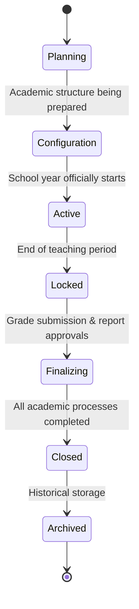

# AcademiQ State Diagram — Academic Year Lifecycle

🧠 What This State Diagram Defines

This models how an Academic Year entity transitions from planning to archival.

🟡 Planning

The year is created but not yet configured.
School is preparing high-level setup.

⚙️ Configuration

Admins are setting up:

Curriculum version

Subjects

Passing grades

Class structure

Academic operations are not yet allowed.

🟢 Active

The academic year is officially running:

Attendance recording

Grading

Enrollment changes
All operational modules reference this year.

🔒 Locked

Teaching period has ended.
New grades or attendance entries are no longer allowed, but report processing continues.

📝 Finalizing

Administrative closing phase:

Final grade submissions

Report card approvals

Promotion decisions

✅ Closed

All academic processes for the year are complete.
Data becomes read-only.

📦 Archived

The year moves into long-term historical storage.
Used only for reporting and audits.

🎯 Why This Matters

This lifecycle controls:

✔ When grades can be entered
✔ When schedules are editable
✔ When promotions can run
✔ When data becomes read-only

It becomes a global rule provider for other services.
