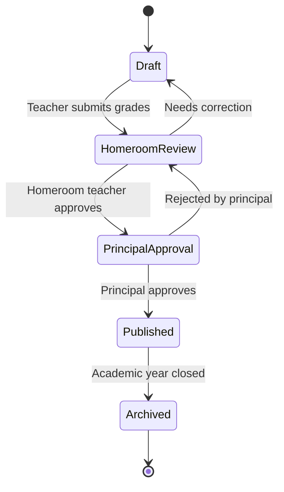

# AcademiQ State Diagram — Report Card Lifecycle

🧠 What This State Diagram Covers

This models the full lifecycle of a student’s report card within one academic year.

🟡 Draft

Initial state after subject teachers submit grades.
Report card is still editable.

👩‍🏫 Homeroom Review

The homeroom teacher reviews:

Grade completeness

Behavioral notes

Attendance summary

Can send it back to Draft if corrections are needed.

🏫 Principal Approval

Final academic authority checks and approves.

If rejected → goes back to Homeroom Review.

🟢 Published

Report card becomes visible to:

Students

Parents

At this stage, it should be locked from editing.

📦 Archived

When the academic year closes, report cards move to archive:

Read-only

Historical record

🎯 Why This Matters

This diagram will drive:

Permission rules (who can edit at each state)

UI behavior (editable vs locked)

Audit logging

Notification triggers
