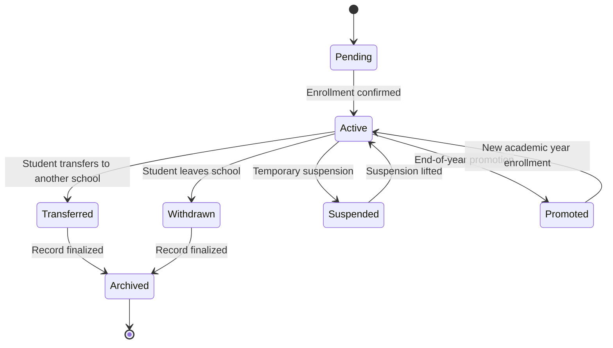

# AcademiQ State Diagram — Student Enrollment Status Lifecycle

🧠 What This Diagram Models

This represents the lifecycle of a student’s enrollment record within a school, not the student entity itself.

A student can exist in the system, but their enrollment status changes over time.

🟡 Pending

Enrollment created but not yet fully confirmed
(e.g., waiting for documents or admin approval)

🟢 Active

Student is officially enrolled and participating in school activities:

Attendance

Grades

Reports

This is the normal operational state.

⏸ Suspended

Temporary status due to disciplinary or administrative reasons.
Student remains enrolled but may have limited participation.

Can return to Active when suspension ends.

🔄 Transferred

Student moves to another school.
Enrollment ends but historical data must remain intact.

❌ Withdrawn

Student leaves school permanently (non-transfer case).
Still part of historical academic records.

🎓 Promoted

End-of-year state indicating the student has successfully completed the grade level.

Transitions to Active again when enrolled in the next academic year.

📦 Archived

Final historical state for closed enrollment records:

No further changes allowed

Used only for reporting/audits

🎯 Why This Matters

This state machine drives:

✔ Attendance eligibility
✔ Grade submission validity
✔ Report generation rules
✔ Transfer and withdrawal workflows

It prevents inconsistent scenarios like:

Recording attendance for a transferred student.

---
What about alumni status?
===

Excellent question — and this is where many school systems get the model wrong.

Short answer:

🎓 Alumni is NOT an enrollment state
🧑‍🎓 It is a student lifecycle status after graduation

Let’s clarify the boundary.

🧠 Enrollment vs Student Lifecycle

We already modeled Enrollment Status per academic year:

Pending

Active

Suspended

Transferred

Withdrawn

Promoted

Archived

These describe:

“Is the student currently enrolled in this school year?”

But Alumni answers a different question:

“Has this person completed their education at this school?”

That belongs to the Student entity, not Enrollment.

🎓 Correct Modeling
📍 Enrollment Lifecycle (Year-Based)

Handles participation during schooling.

📍 Student Lifecycle (Long-Term Identity)

Handles status across years.

So we introduce a new state diagram:

Student Academic Status Lifecycle

🧑‍🎓 Student Academic Status States

Typical lifecycle:

State	Meaning
Applicant	Applied but not enrolled yet
Active Student	Currently studying
Graduated	Completed final grade
Alumni	Former student, historical member
Dropped Out	Left without graduating
🔄 How It Connects to Enrollment
Event	Effect
Student promoted to final grade → passes	Student → Graduated
Academic year closed after graduation	Student → Alumni
Student withdraws permanently	Student → Dropped Out

So:

Enrollment ends each year

Student status persists across lifetime

🏗 Why Alumni Should Be Separate

If you put Alumni in Enrollment:
❌ You lose meaning when the student has multiple past enrollments
❌ Reporting becomes messy
❌ Alumni relations features become harder later

If you put Alumni in Student:
✅ Clean long-term identity
✅ Easy alumni portal later
✅ Historical reporting stays accurate

📌 Architectural Impact

Alumni status will affect:

Access rules (read-only portal)

Transcript generation

Alumni communication modules (future)
