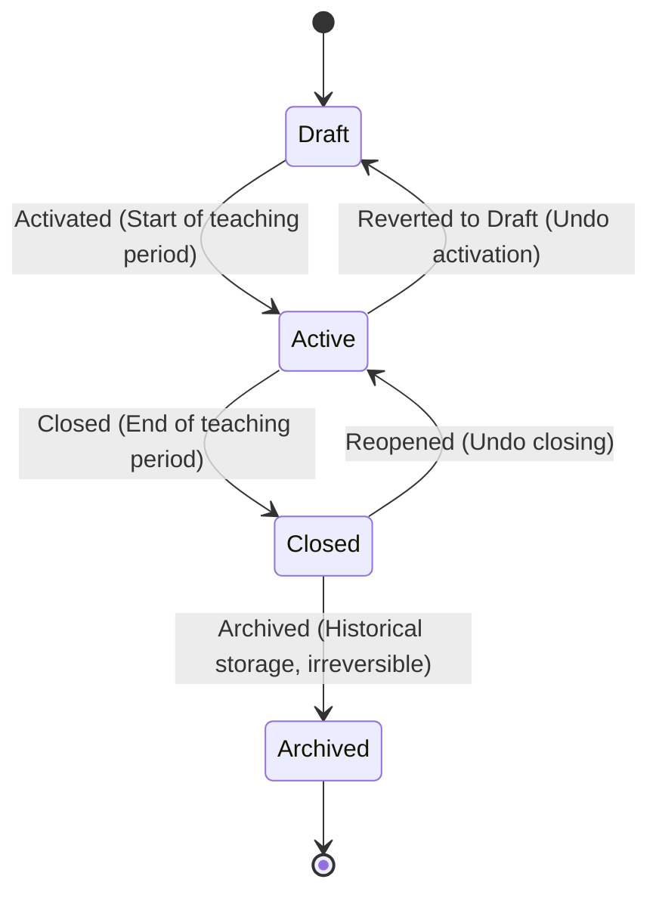

# AkademiQ State Diagram — Academic Year Lifecycle

🧠 What This State Diagram Defines

This models how an Academic Year entity transitions from creation to archival. To ensure accountability, every status change requires a minimum 10-character explanation (`reason`), which is written to the `academic_year_status_transition` table as an audit log.

🟡 Draft

- The year is created but not yet finalized.
- Admins configure the curriculum version, subjects, passing grades, and class structures.
- Academic operations (e.g., grading, attendance recording) are not yet allowed.

🟢 Active

- The academic year is officially running.
- Operational modules reference this year for attendance recording, grading, and enrollment.
- Only one academic year can be `Active` per tenant at any given time.

✅ Closed

- The teaching period has ended, and all academic processes are completed.
- Data becomes read-only.
- New grades and class edits are locked.
- The year can be reopened back to `Active` (which checks for active year conflicts).

📦 Archived

- The year moves into long-term historical storage.
- Used only for reporting and audits.
- **Irreversible**: Once archived, it cannot transition back to any other state.
- Transitioning to this state triggers the archival of all report cards for this year.

🎯 Why This Matters

This lifecycle controls:
✔ When grades can be entered (only in `Active`)
✔ When schedules are editable (only in `Draft` or `Active`)
✔ When data becomes read-only (in `Closed` or `Archived`)
✔ When audit logs are recorded for accountability (every transition requires a `reason`)

