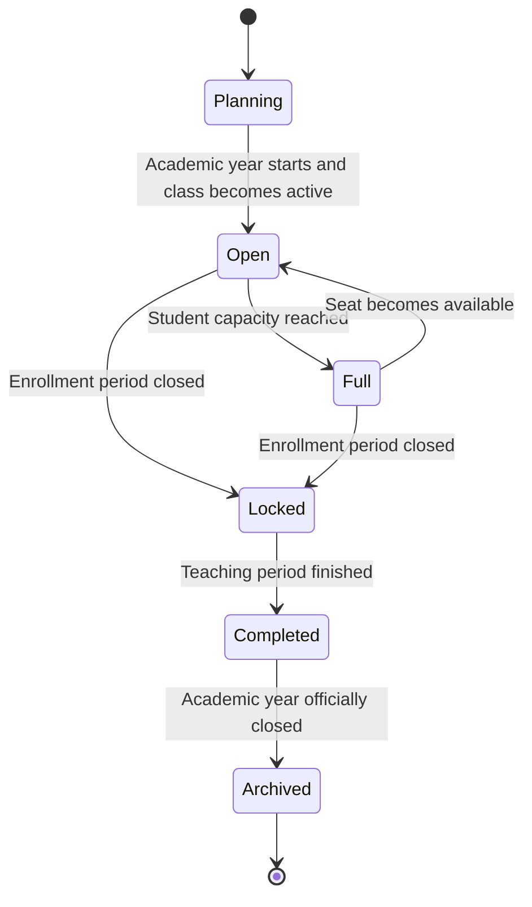

# AkademiQ State Diagram — Class / Homeroom Lifecycle

🧠 What This Lifecycle Represents

This models the lifecycle of a class (homeroom) within a single academic year.

It controls:

When students can join

When enrollment closes

When the class becomes historical

🟡 Planning

Class is created during academic year setup but not yet active.
No students assigned yet.

🟢 Open

Class is active and can accept students.
Attendance and grading are operational.

👥 Full

Maximum student capacity reached.
System should block further enrollment unless a seat opens.

Can return to Open if a student leaves.

🔒 Locked

Enrollment period has ended.
No new students can be added, but teaching and grading continue.

✅ Completed

Teaching period is finished.
No more attendance or grading entries allowed.

📦 Archived

Class is closed and stored as historical data after the academic year closes.

🎯 Why This Matters

This state machine drives:

✔ Enrollment validation
✔ Capacity control
✔ UI behavior (add student button visible or not)
✔ Attendance & grading availability
