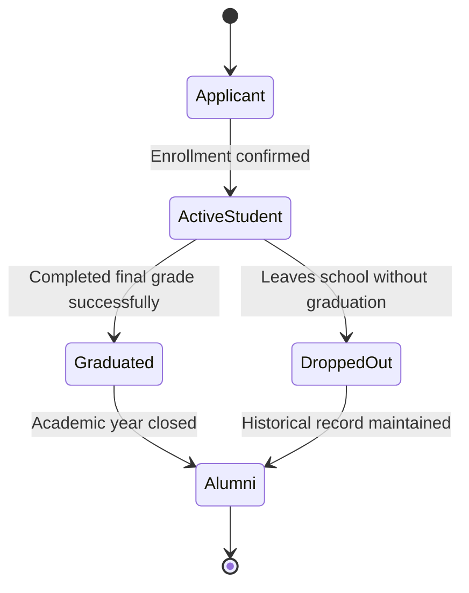

# AkademiQ State Diagram — Student Academic Status Lifecycle

🧠 What This Diagram Models

This lifecycle represents the long-term academic identity of a student, separate from yearly enrollment.

It answers:

“What is this person’s overall academic relationship with the school?”

🟡 Applicant

Prospective student who has applied but is not yet enrolled.

🟢 Active Student

Currently studying and participating in academic activities.

🎓 Graduated

Student has successfully completed the final grade level but the academic year has not yet been officially closed.

🧑‍🎓 Alumni

Former student with completed academic history.
Data becomes historical and read-only.

❌ Dropped Out

Student left the school before completing the final grade.

For historical tracking, they may still transition to Alumni (former student status without graduation).
