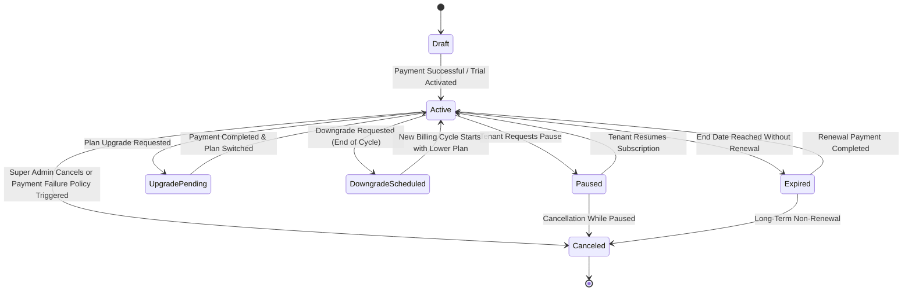

# AkademiQ Subscription State Diagram

```mermaid
stateDiagram-v2

[*] --> Draft

Draft --> Active : Payment Successful / Trial Activated
Active --> Paused : Tenant Requests Pause
Paused --> Active : Tenant Resumes Subscription

Active --> UpgradePending : Plan Upgrade Requested
UpgradePending --> Active : Payment Completed & Plan Switched

Active --> DowngradeScheduled : Downgrade Requested (End of Cycle)
DowngradeScheduled --> Active : New Billing Cycle Starts with Lower Plan

Active --> Expired : End Date Reached Without Renewal
Expired --> Active : Renewal Payment Completed

Active --> Canceled : Super Admin Cancels or Payment Failure Policy Triggered
Paused --> Canceled : Cancellation While Paused
Expired --> Canceled : Long-Term Non-Renewal

Canceled --> [*]
```
