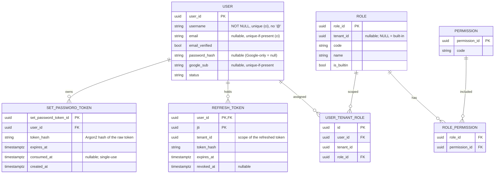

# AcademiQ ERD — Identity & Access Service

## 🧠 What This Database Owns
This service handles authentication and authorization.

### Main Entities
| Entity | Purpose |
|-------|---------|
| User | Login identity. `username` is the universal key; `email`, `password_hash`, and `google_sub` are all optional, enabling email/username/Google login and passwordless accounts. `google_sub` has a partial unique index when present. |
| Role | Group of permissions. Built-in roles have `tenant_id = NULL`; custom roles are tenant-scoped and cannot shadow built-in codes. |
| Permission | Fixed platform-owned action vocabulary used by authorization guards. |
| Role Permission | Many-to-many grant table between roles and permissions. |
| User Tenant Role | Role assignment per tenant (a user may hold one or many roles in a tenant) |
| Refresh Token | Tenant-scoped refresh credential; refreshing renews the same tenant's access token |
| Set Password Token | Single-use, time-bound token issued when a passwordless account is created (via invite accept). Consumed on first use; rejected after expiry. Enables self-service password set without a live session. |

## 🔗 Important Relationships
Users receive roles within a tenant scope, and roles grant permissions. Identity
and membership are separate: a user can exist with **no** tenant membership
(public signup or Google auto-provision) and may belong to **many** tenants.
Login resolves a user without a tenant; a tenant is selected afterward, and
`User Tenant Role` is checked when issuing a tenant-scoped token. The access token carries both `roles[]` (role identity for display/workflows) and `perms[]` (deduplicated permission union used by guards).

Google-only users and passwordless invite accept both have `password_hash = NULL`; password login
against these rows returns `PASSWORD_NOT_SET` (distinct from `INVALID_CREDENTIALS`) so the client
can route the user to the set-password flow. Verified Google email auto-link sets both `google_sub`
and `email_verified=true` on the existing row.

## ⚠️ Last-role invariant

Tenant membership is expressed **solely** through `User Tenant Role` rows —
there is no separate membership table. A user belongs to a tenant only while
they hold ≥1 role there. Because of this:

- Removing a user's **last** role in a tenant is refused with `409 LAST_ROLE`
  (it would silently un-enroll them). Use the explicit off-boarding action
  (`DELETE /tenants/me/users/{id}`) instead, which drops all of the user's roles
  in the tenant in one transaction and emits `tenant_user.removed`.
- Removing the tenant's only holder of `user.role.assign` is refused with
  `409 LAST_ADMIN`.

Neither guard deletes the global `User` row; off-boarding only removes the
tenant's `User Tenant Role` rows.
