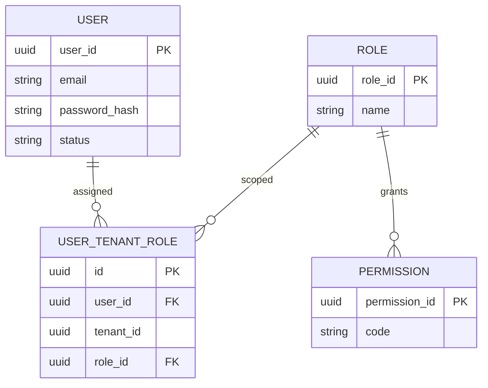

# AcademiQ ERD — Identity & Access Service

## 🧠 What This Database Owns
This service handles authentication and authorization.

### Main Entities
| Entity | Purpose |
|-------|---------|
| User | Login identity |
| Role | Group of permissions |
| Permission | Fine-grained access control |
| User Tenant Role | Role assignment per tenant |

## 🔗 Important Relationships
Users receive roles within a tenant scope, and roles grant permissions.