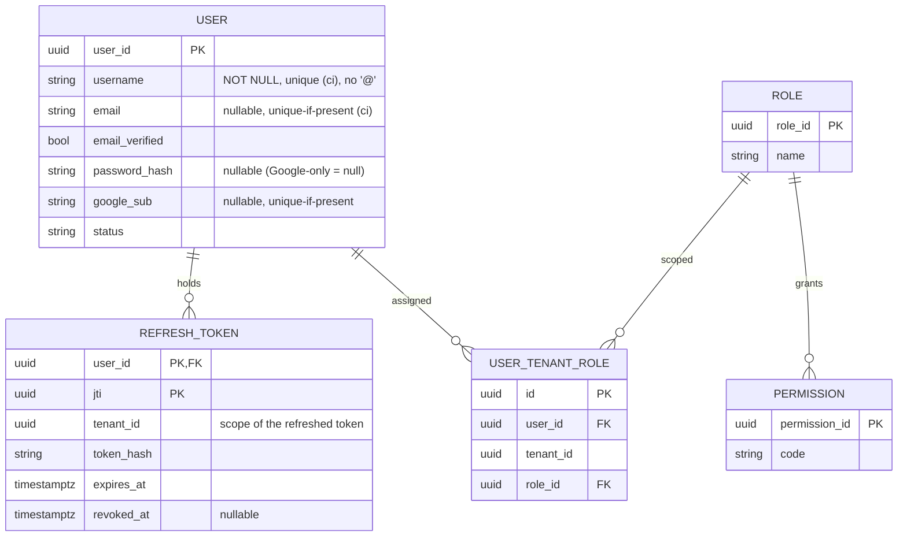

# AcademiQ ERD — Identity & Access Service

## 🧠 What This Database Owns
This service handles authentication and authorization.

### Main Entities
| Entity | Purpose |
|-------|---------|
| User | Login identity. `username` is the universal key; `email`, `password_hash`, and `google_sub` are all optional, enabling email/username/Google login and passwordless accounts. |
| Role | Group of permissions |
| Permission | Fine-grained access control |
| User Tenant Role | Role assignment per tenant (a user may have zero or many) |
| Refresh Token | Tenant-scoped refresh credential; refreshing renews the same tenant's access token |

## 🔗 Important Relationships
Users receive roles within a tenant scope, and roles grant permissions. Identity
and membership are separate: a user can exist with **no** tenant membership
(public signup or Google auto-provision) and may belong to **many** tenants.
Login resolves a user without a tenant; a tenant is selected afterward, and
`User Tenant Role` is checked when issuing a tenant-scoped token.