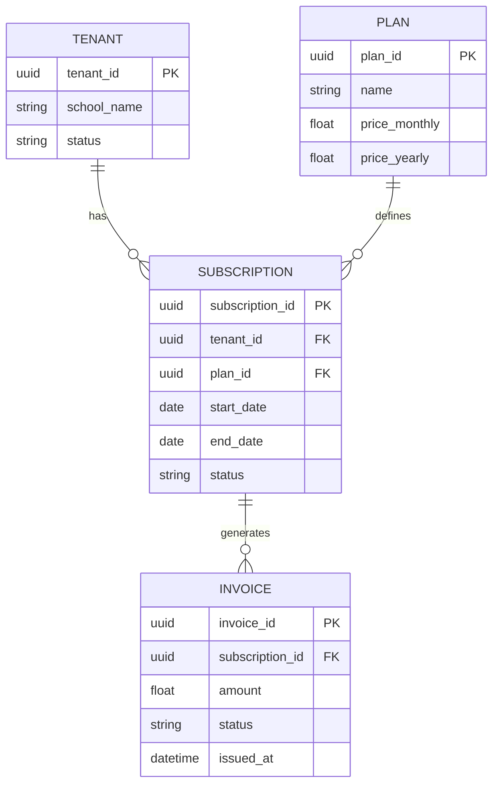

# AcademiQ ERD — Tenant & Subscription (Billing) Service

## 🧠 What This Database Owns
This service manages the commercial relationship between schools and the platform.

### Main Entities
| Entity | Purpose |
|-------|---------|
| Tenant | A subscribing school |
| Plan | Subscription package |
| Subscription | Active plan contract |
| Invoice | Billing transaction record |

## 🔗 Important Relationships
Tenants subscribe to plans via subscriptions, which generate invoices for payments.