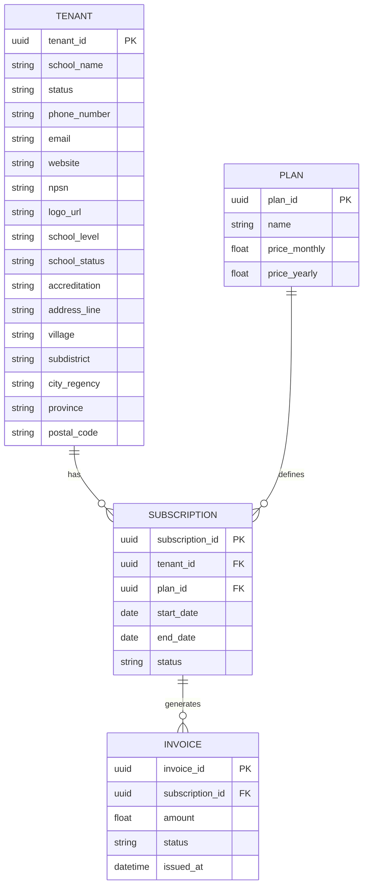

# AkademiQ ERD — Tenant & Subscription (Billing) Service

## 🧠 What This Database Owns
This service manages the commercial relationship between schools and the platform,
and owns the **school profile** (identity/contact/address/branding) for the tenant.

### Main Entities
| Entity | Purpose |
|-------|---------|
| Tenant | A subscribing school, plus complete school profile identity/contact/address/branding |
| Plan | Subscription package |
| Subscription | Active plan contract |
| Invoice | Billing transaction record |

## 🔗 Important Relationships
Tenants subscribe to plans via subscriptions, which generate invoices for payments.
The tenant row carries the complete school profile (school level, NPSN, accreditation,
address components, public/private status). School profile does **not**
include kepala sekolah / head-teacher linkage in the current design — that coupling is
deferred until document/signature requirements need it.

## School logo storage
The `tenant.logo_url` column stores a host-agnostic `media://{owner_id}/{media_id}.{ext}`
URI. Uploading a new logo replaces the previous one (single-active, no history). The HTTP
layer resolves this URI to a public serve path
(`/api/v1/billing/media/school/{media_id}`) before returning it to the frontend.
Stored blob objects live under the `school/` prefix in the configured storage backend
(local or R2). The previous blob is garbage-collected on replace or clear.
