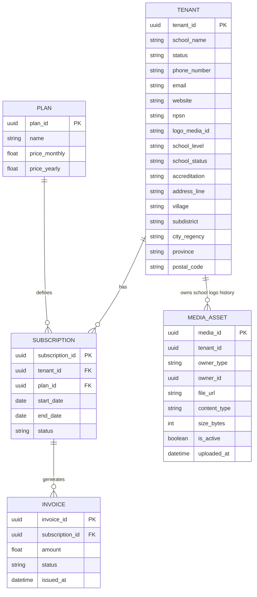

# AkademiQ ERD — Tenant & Subscription (Billing) Service

## 🧠 What This Database Owns
This service manages the commercial relationship between schools and the platform,
and owns the **school profile** (identity/contact/address/branding) for the tenant.

### Main Entities
| Entity | Purpose |
|-------|---------|
| Tenant | A subscribing school, plus complete school profile identity/contact/address/branding |
| Plan | Subscription package |
| Subscription | Active plan contract |
| Invoice | Billing transaction record |
| MediaAsset | Logo upload history for the school (owner_type = `school`) |

## 🔗 Important Relationships
Tenants subscribe to plans via subscriptions, which generate invoices for payments.
The tenant row carries the complete school profile (school level, NPSN, accreditation,
address components, logo reference, public/private status). School profile does **not**
include kepala sekolah / head-teacher linkage in the current design — that coupling is
deferred until document/signature requirements need it.

## School profile ownership
The tenant represents the subscribing school, so Billing owns the school's
identity/contact/branding profile. Academic people data (students, teachers, family
profiles) is owned by Academic Ops. Media assets for school logos live here; media for
people photos lives in Academic Ops because the owner entities live there.