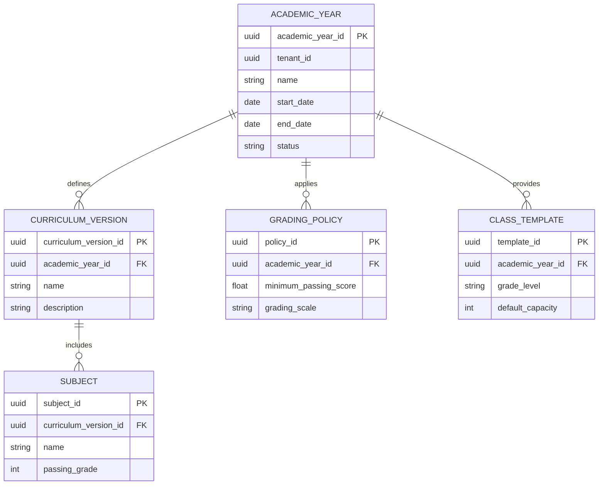

# AcademiQ ERD — Academic Configuration Service

## 🧠 What This Database Owns
This service stores year-based academic structure and rules. It defines how the school operates in a given academic year.

### Main Entities
| Entity | Purpose |
|-------|---------|
| Academic Year | Defines a school year period |
| Curriculum Version | Snapshot of curriculum used that year |
| Subject | Subjects taught under that curriculum |
| Grading Policy | Rules for scoring and passing |
| Class Template | Default class structure for yearly setup |

## 🔗 Important Relationships
Academic years define curriculum versions and grading policies. Subjects belong to a curriculum version. Class templates help initialize homerooms for the year.