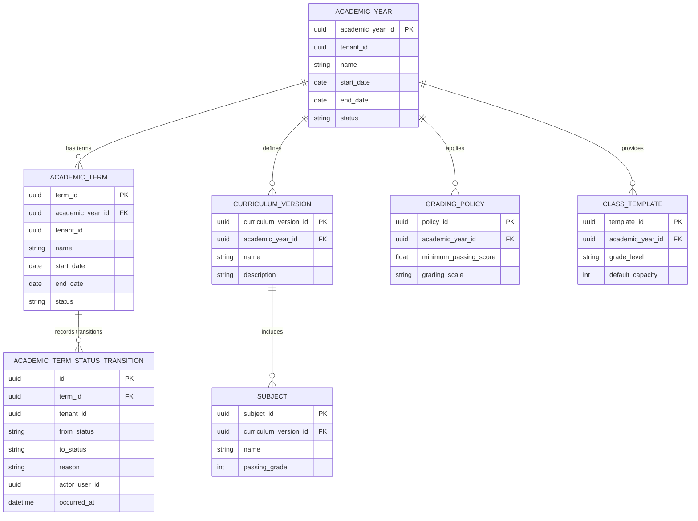

# AcademiQ ERD — Academic Configuration Service

## 🧠 What This Database Owns
This service stores year-based academic structure and rules. It defines how the school operates in a given academic year.

### Main Entities
| Entity | Purpose |
|-------|---------|
| Academic Year | Defines a school year period |
| Academic Term | A child period within a year (e.g. Semester 1, Semester 2) |
| Academic Term Status Transition | Audit log for term lifecycle changes |
| Curriculum Version | Snapshot of curriculum used that year |
| Subject | Subjects taught under that curriculum |
| Grading Policy | Rules for scoring and passing |
| Class Template | Default class structure for yearly setup |

## 🔗 Important Relationships
Academic years define curriculum versions and grading policies. Each academic year has at least one term (auto-seeded on creation). Subjects belong to a curriculum version. Class templates help initialize homerooms for the year.

## Invariants
- Every `academic_year` always has ≥ 1 `academic_term` (default `"Semester 1"` is seeded on creation).
- At most one term per year may be `Active` (enforced by partial unique index `academic_term_one_active_per_year_idx`).
- Term `start_date`/`end_date` must fall within the parent year's range (app-layer).
- Terms within a year must not overlap (app-layer).
- A year cannot transition to `Closed` while any of its terms is `Active` (`TERM_STILL_ACTIVE`).
