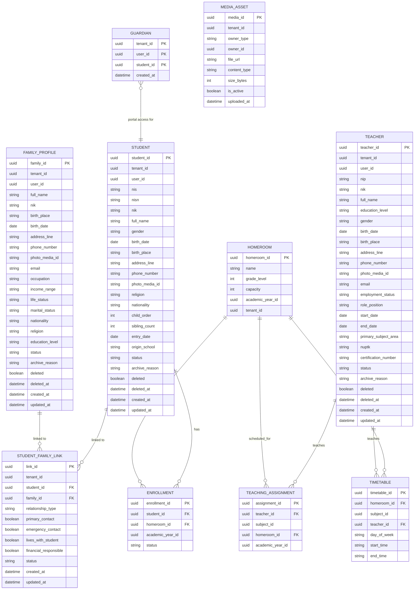

# AcademiQ ERD — Academic Operations Service

## 🧠 What This Database Owns
This service handles daily academic structure, not grades or billing. It owns the
complete operational master data: students, teachers, family profiles, and their
media/photo history.

### Main Entities
| Entity | Purpose |
|-------|---------|
| Student | Master student data per tenant (complete Indonesian school biodata) |
| Teacher | Teacher identity inside the school (complete biodata + employment) |
| FamilyProfile | Reusable family/guardian biodata (ayah/ibu/wali), many-to-many with students |
| StudentFamilyLink | Relationship link between a student and a family profile |
| Guardian | Explicit portal/report-card access link (separate from family biodata) |
| Homeroom | A class in a specific academic year |
| Enrollment | Student ↔ Homeroom relationship per year |
| TeachingAssignment | Which teacher teaches which subject in which class |
| Timetable | Weekly schedule for classes |
| MediaAsset | Photo upload history for teacher/student/family owners |

## 🔗 Important Relationships

### Student ↔ Enrollment ↔ Homeroom
A student can be enrolled in one homeroom per academic year and have multiple historical
enrollments. Student master data does **not** store current class as authoritative state;
class placement is always represented by enrollment records.

### Family profiles ↔ students (many-to-many)
A family profile is reusable biodata that can be linked to multiple students (siblings),
and a student can have multiple family profiles (ayah, ibu, wali). Each link carries
relationship attributes (relationship type, primary/emergency/financial flags,
lives-with-student, active/inactive status).

### Family profiles vs guardian access (critical separation)
- **FamilyProfile + StudentFamilyLink** = administrative biodata for family members.
  Optionally stores a linked IAM `user_id` but does **not** grant portal access.
- **Guardian** = explicit portal/report-card authorization grant for an IAM user to a
  student. Managed independently; creating/removing a family link must never mutate
  guardian access rows.

### Media history
Logo and photo uploads use file-backed assets. Replacing a photo creates a new active
asset and keeps previous assets visible in history. Media is tenant+owner scoped.

### Profile vs IAM contact data
Student, teacher, and family profile email/phone fields are administrative contact data.
Linked IAM user email and membership data remain login/access data and are not
synchronized automatically.