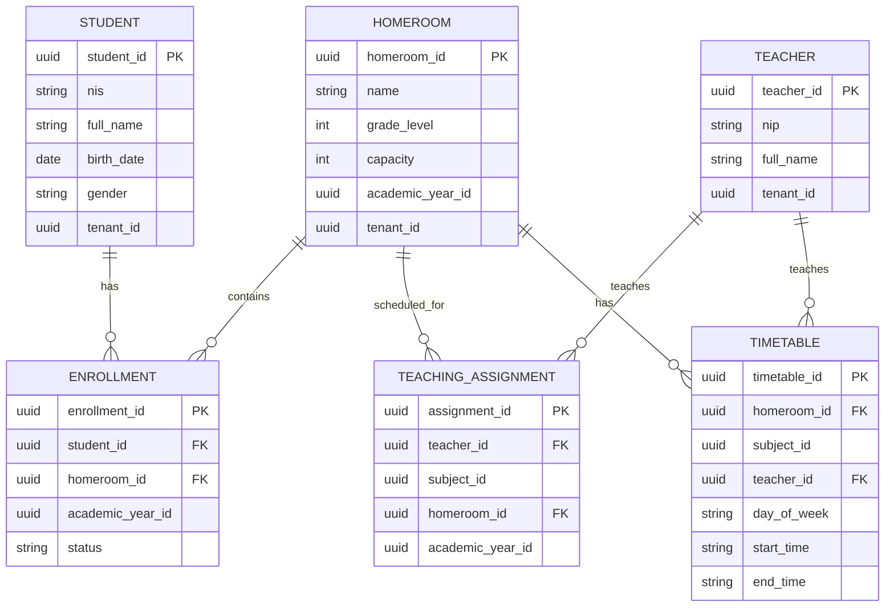

# AcademiQ ERD — Academic Operations Service

## 🧠 What This Database Owns
This service handles daily academic structure, not grades or billing.

### Main Entities
| Entity | Purpose |
|-------|---------|
| Student | Master student data per tenant |
| Teacher | Teacher identity inside the school |
| Homeroom | A class in a specific academic year |
| Enrollment | Student ↔ Homeroom relationship per year |
| TeachingAssignment | Which teacher teaches which subject in which class |
| Timetable | Weekly schedule for classes |

## 🔗 Important Relationships

### Student ↔ Enrollment ↔ Homeroom
A student can be enrolled in one homeroom per academic year and have multiple historical enrollments.

### Teacher ↔ Teaching Assignment
Teachers are assigned per subject per class, supporting multiple teachers per class.

### Timetable
Links homeroom, teacher, subject, and time slot for scheduling and attendance.