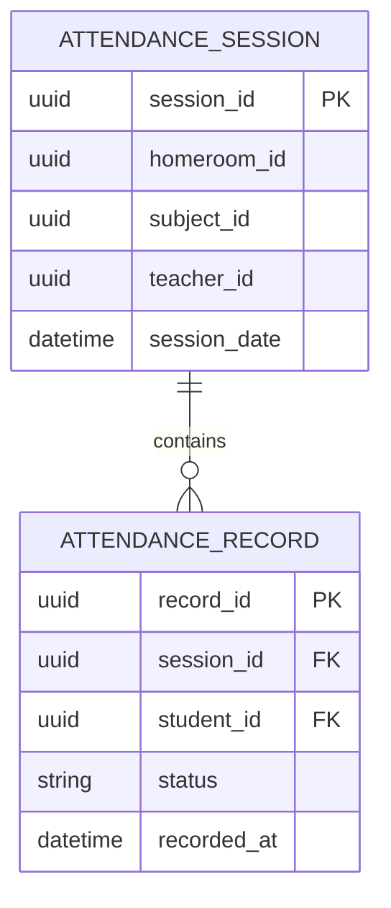

# AkademiQ ERD — Attendance Service

## 🧠 What This Database Owns
This service records class attendance per session.

### Main Entities
| Entity | Purpose |
|-------|---------|
| Attendance Session | One teaching session instance |
| Attendance Record | Presence status per student |

## 🔗 Important Relationships
Each session contains many attendance records, one per student.