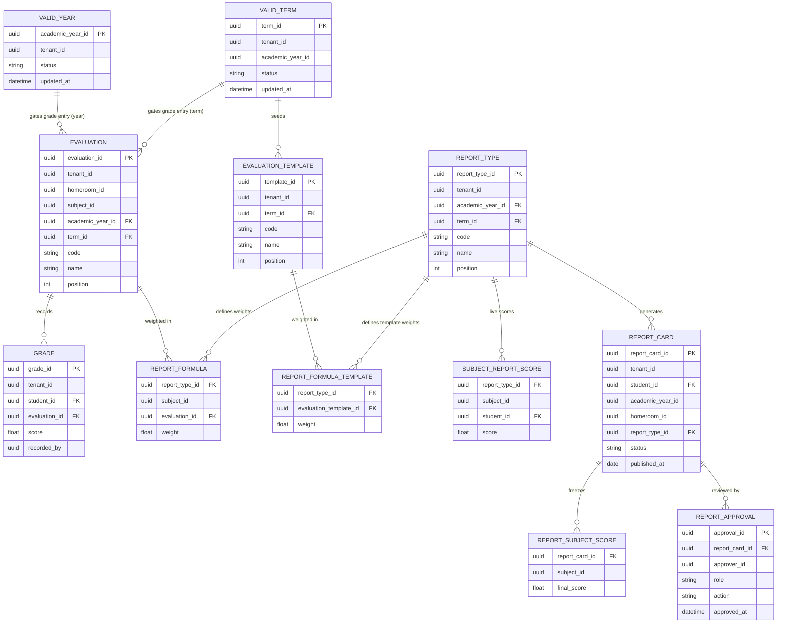

# AkademiQ ERD — Grading & Report Service

## 🧠 What This Database Owns
This service manages evaluations, grading records, report types, and report card workflows. It also holds local projection tables (`valid_year`, `valid_term`) to gate operations without cross-service calls.

### Main Entities
| Entity | Purpose |
|-------|---------|
| Valid Year | Projection of academic year status from academic-config-service |
| Valid Term | Projection of academic term status from academic-config-service |
| Evaluation | A scored activity (quiz, exam) scoped to `(homeroom, subject, year, term)` |
| Evaluation Template | Per-term master evaluation list used to seed concrete evaluations |
| Grade | Individual student score for an evaluation |
| Report Type | A report card type scoped to `(year, term)` |
| Report Formula | Weight mapping of evaluations to a report type per subject |
| Report Formula Template | Weight mapping of template evaluations to a report type |
| Subject Report Score | Live computed score per `(report_type, subject, student)` |
| Report Card | Aggregated result per `(student, report_type)` |
| Report Subject Score | Frozen per-subject score on a report card |
| Report Approval | Multi-step approval history |

## 🔗 Important Relationships
Evaluations and report types are both scoped to a `(year, term)` pair. Report formulas link evaluations to report types; adding a formula is rejected if the evaluation's `term_id` differs from the report type's `term_id` (`EVALUATION_TERM_MISMATCH`). Grade entry is gated on both the year (`YEAR_NOT_ACTIVE`) and the term (`TERM_NOT_ACTIVE`) being `Active`.

Evaluation templates are term-scoped seeds. On `teacher.assigned`, grading materializes concrete evaluations for Draft/Active terms in the assignment's year using `ON CONFLICT DO NOTHING`; repeated event deliveries are safe. The apply endpoint performs the same materialization for assignments in a term that still have zero evaluations. Weight templates materialize into `report_formula` only when matching report types exist. Closed and Archived terms are skipped by event materialization.

## Projection Pattern
`valid_year` and `valid_term` are write-only projections consumed from outbox events (`academic_year.status_changed`, `academic_term.created`, `academic_term.status_changed`). There are no physical foreign keys to academic-config-service tables.

## Unique Constraints
- Evaluation: `(tenant_id, homeroom_id, subject_id, academic_year_id, term_id, code)` — allows same code across terms.
- Evaluation template: `(tenant_id, term_id, code)` — one template column code per term.
- Report type: `(academic_year_id, term_id, code)` — allows same code across terms.
- Report formula template: `(report_type_id, evaluation_template_id)` — one template weight per report type/template evaluation.
