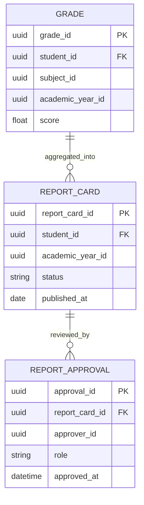

# AcademiQ ERD — Grading & Report Service

## 🧠 What This Database Owns
This service manages grading records and report card workflows.

### Main Entities
| Entity | Purpose |
|-------|---------|
| Grade | Individual subject score per student |
| Report Card | Aggregated yearly academic result |
| Report Approval | Approval tracking workflow |

## 🔗 Important Relationships

Grades are aggregated into report cards per academic year.  
Report cards go through multi-step approval before publication.