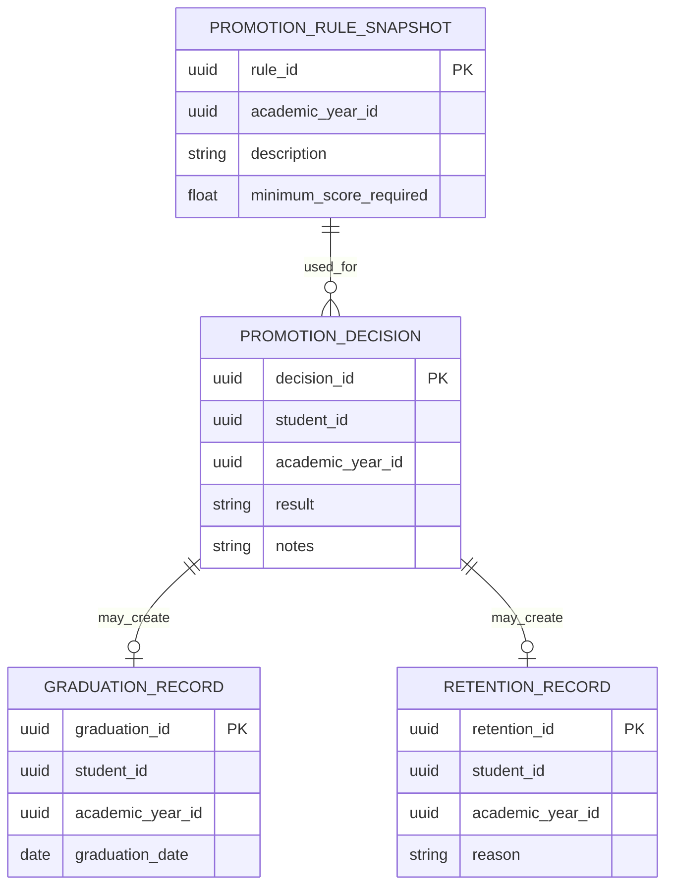

# AkademiQ ERD — Promotion Service

## 🧠 What This Database Owns
This service manages end-of-year academic progression decisions.

### Main Entities
| Entity | Purpose |
|-------|---------|
| Promotion Decision | Student advancement result |
| Graduation Record | Graduation tracking |
| Retention Record | Students repeating a grade |
| Promotion Rule Snapshot | Rules used during promotion evaluation |

## 🔗 Important Relationships
Promotion decisions are made based on rule snapshots. A decision may produce either a graduation or retention record.