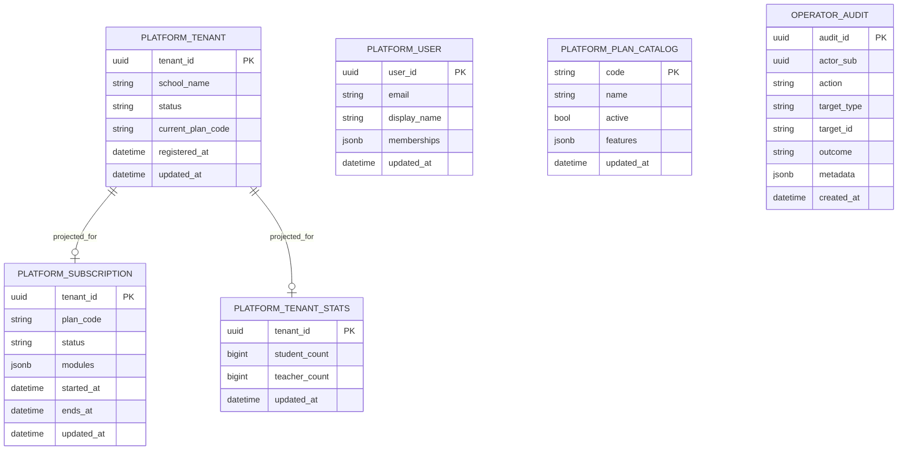

# AkademiQ ERD — Platform Service

## 🧠 What This Database Owns

Almost nothing — and that is the point. `platform_db` owns exactly one
authoritative table, `operator_audit`. Every other table is a **read-only
projection** rebuilt from events published by the owning service. Billing remains
the source of truth for tenants, plans, and subscriptions; IAM for users.

The relationships in the diagram are projection co-location, not foreign keys.
There are no FK constraints between these tables: events arrive in arbitrary
order, so a subscription row can exist before its tenant row. Every consumer path
UPSERTs.

### Main Entities

| Entity | Owned? | Purpose |
|--------|--------|---------|
| Platform Tenant | projection | Cross-tenant directory for the operator console |
| Platform Subscription | projection | Plan, status, dates, and module map per tenant |
| Platform Tenant Stats | projection | Student/teacher counts for the usage overview |
| Platform User | projection | Cross-tenant user directory with tenant memberships |
| Platform Plan Catalog | projection (**dormant**) | Intended plan mirror; see below |
| Operator Audit | **owned** | Append-only record of every operator mutation |

Projections are rebuildable from scratch via
`apps/backend/scripts/bootstrap-projections.sh`, which backfills them by reading
the owning services' databases directly.

## `platform_plan_catalog` is dormant — do not read it

The table exists and has an UPSERT path, but it has **no working producer**.
Billing emits `plan.created` / `plan.updated` / `plan.deactivated`, which neither
match platform-service's `plan-catalog.*` queue binding nor carry a `features`
field. In every real environment the table is empty.

Consequently `GET /plans` and the `entitled` flag on
`GET /tenants/{id}/modules` both read **live from billing** over
`X-Service-Token` instead. Reading the local table would report "entitled:
false" for every tenant everywhere. Either wire a real producer or drop the
table; do not quietly start reading it.

## `platform_subscription.modules` has two writers

The `modules` column is a JSONB object mapping `feature_code -> bool`. It is
written by two distinct paths with different semantics, and the distinction
matters:

| Path | Event | Write semantics |
|------|-------|-----------------|
| `upsert_subscription` | `subscription.activated`, `subscription.plan_changed` | **Full replacement** — but only when the event carries a `modules` map |
| `patch_subscription_module` | `tenant.module_toggled` | **Single-key JSONB patch** (`modules \|\| jsonb_build_object(k, v)`) — other keys untouched |

### Why `upsert_subscription` takes `Option<Value>`

Neither `subscription.activated` nor `subscription.plan_changed` carries a
`modules` field today, so the decoded payload yields `None`. The repo signature is
`modules: Option<Value>` and the UPSERT uses
`modules = COALESCE($4, platform_subscription.modules)`:

- `None` **preserves** whatever is already projected — notably the keys written by
  `tenant.module_toggled`. Without this, any later subscription event would wipe
  the module map, and there is no self-healing path that would restore it
  (billing does not re-emit toggles).
- `Some(..)` is authoritative and replaces the whole object, so the column is
  still correctable if a subscription event ever starts carrying modules.

### Row creation ordering

`tenant.module_toggled` can arrive before any subscription event for the same
tenant — an operator override (`POST /internal/tenants/{id}/subscription`) emits
only `subscription.plan_changed`, so `subscription.activated` never fires for
those tenants. `patch_subscription_module` therefore INSERTs the row when absent,
and migration `V2__module_projection.sql` gives `plan_code` and `status` the
default `'unknown'` so the NOT NULL columns can be satisfied without inventing a
plan. A later subscription event overwrites both. This is why
`GET /tenants/{id}/subscription` can legitimately return
`plan_code: "unknown"`.

See `11_integration_contracts/events/tenant.module_toggled.md` for the full
ordering contract.

## 🔗 Important Relationships

`operator_audit` is deliberately unlinked from the projections. It records
`actor_sub` (the operator's JWT `sub`), the action, the target type/id as free
text, and a JSONB metadata blob — so an audit row survives the target being
deleted upstream, and the table can be retained on a different schedule from the
projections it describes. Rows are written only after a downstream mutation
returns 2xx; reads are never audited.
