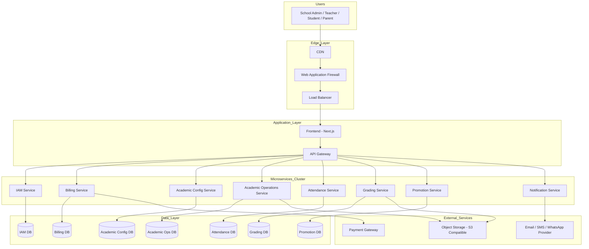

# AkademiQ Deployment & Infrastructure Architecture

🧠 What This Diagram Represents

This is Level 11 — Deployment / Infrastructure Architecture.
It shows how AkademiQ is deployed in a production cloud environment.

We now move from logical architecture to physical/runtime architecture.

🌍 Edge Layer (Internet Facing)
Component	Purpose
CDN	Speeds up static asset delivery (JS, images)
WAF	Protects against common attacks (SQLi, XSS, bots)
Load Balancer	Distributes traffic across app instances

This layer improves performance, security, and availability.

🖥 Application Layer
Component	Purpose
Frontend (Next.js)	Serves UI to users
API Gateway	Single entry point to all backend services

The API Gateway handles:

Auth token forwarding

Routing

Rate limiting (future)

🧩 Microservices Cluster

These run inside containers (Docker) and are orchestrated (e.g., Kubernetes):

IAM Service

Billing Service

Academic Config Service

Academic Operations Service

Attendance Service

Grading Service

Promotion Service

Notification Service

Each service can scale independently.

🗄 Data Layer

Each service has its own database (Database per Service pattern):

Service	Database
IAM	IAM DB
Billing	Billing DB
Academic Config	Config DB
Academic Ops	Ops DB
Attendance	Attendance DB
Grading	Grading DB
Promotion	Promotion DB

This enforces loose coupling and service ownership.

☁️ External Services
Integration	Purpose
Payment Gateway	Subscription payments
Messaging Provider	Email, SMS, WhatsApp
Object Storage (S3)	File uploads, report PDFs
🎯 Why This Diagram Matters

This is used for:

✔ DevOps planning
✔ Cloud cost estimation
✔ Security architecture review
✔ Scaling strategy
✔ Disaster recovery design
