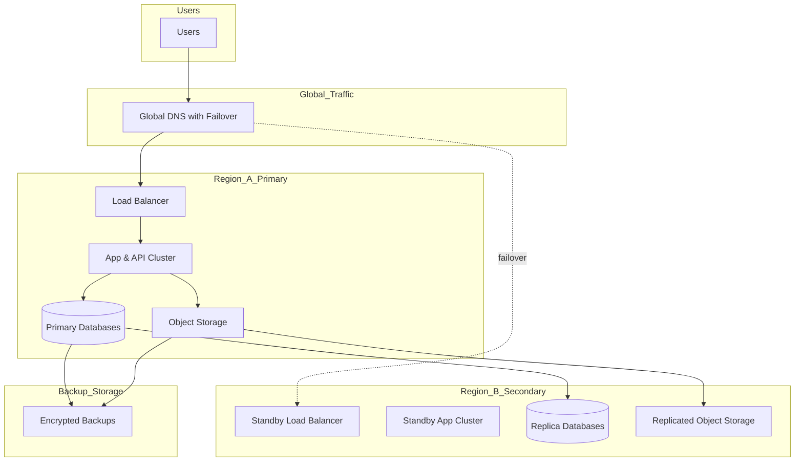

# AkademiQ Disaster Recovery & High Availability Architecture

🧠 What This Architecture Solves

This design protects against:

Server failure

Database crash

Cloud zone outage

Full region outage

It ensures:
✔ High uptime
✔ Minimal data loss
✔ Fast recovery

🌍 Global Traffic Layer
🌐 Global DNS with Failover

Routes users to:

Primary region under normal conditions

Secondary region if the primary is down

Failover can be automatic based on health checks.

🏢 Region A — Primary (Active)

This is where production normally runs.

Includes:

Load balancer

Scalable app/API cluster

Primary databases

Primary object storage

All services run here actively.

🏢 Region B — Secondary (Standby)

This region is your disaster recovery site.

It contains:

Standby app infrastructure

Read replicas of databases

Replicated object storage

It may run in:

Warm standby (ready to scale)
or

Pilot light mode (minimal infra until failover)

🔄 Data Replication
Databases

Primary DB → Replica DB in secondary region

Replication strategy:

Near real-time replication

Regular integrity checks

Object Storage

Files (documents, report PDFs) are replicated across regions.

💾 Backup Layer

Even with replication, you still need backups.

Backups should be:

Encrypted

Stored separately from both regions

Versioned (point-in-time recovery)

🎯 Key Reliability Concepts
Concept	Meaning
High Availability (HA)	Survive server or zone failure without downtime
Disaster Recovery (DR)	Recover from full region loss
RPO	How much data you can afford to lose (e.g., 5 minutes)
RTO	How fast system must be restored (e.g., 30 minutes)
🧭 Result

With this architecture:

✔ Single server failure → no impact
✔ Database failure → failover to replica
✔ Region outage → traffic redirected to secondary
✔ Data corruption → restore from backup
