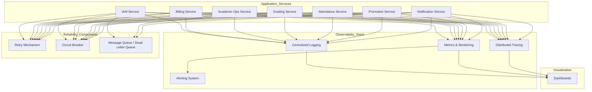

# AcademiQ Observability & Reliability Architecture

🧠 What This Diagram Covers

This layer ensures your system is:

✔ Monitorable
✔ Debuggable
✔ Resilient to failure

It’s not about features — it’s about keeping the platform alive.

🔍 Observability Stack
📝 Centralized Logging

All services send logs to one place (e.g., ELK / OpenSearch).

Used for:

Debugging errors

Auditing

Security review

📊 Metrics & Monitoring

Services expose metrics like:

Request count

Error rate

Response time

DB latency

Collected by tools like Prometheus.

🧵 Distributed Tracing

Tracks a request across multiple services.

Example:
Login → API Gateway → IAM → Tenant → back

Tools like Jaeger or Tempo help you see:

Where latency happens

Which service failed

🚨 Alerting

When metrics cross thresholds:

High error rate

Service down

DB connection failures

Alerts go to email/Slack.

🛡 Reliability Mechanisms
🔁 Retry Mechanism

Used for temporary failures like:

Network glitches

Payment gateway timeout

Prevents user-facing errors for transient issues.

⚡ Circuit Breaker

Stops calling a failing service repeatedly.

Example:
If Payment Gateway is down → stop requests for 30 seconds.

Prevents cascading failures.

📬 Message Queue / Dead Letter Queue

Used for:

Async events

Retrying failed jobs

Storing messages that couldn’t be processed

Important for:
Notifications, billing events, report generation.

🎯 Why This Is Critical

Without this layer:

You won’t know when services fail

Debugging production issues becomes guesswork

One failure can bring down the whole system

With it:
You get visibility + resilience.
